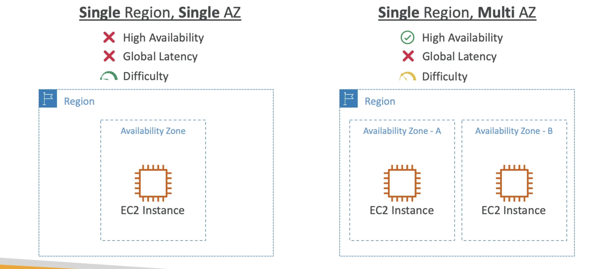

# Local zone

- Places AWS compute, storage, database, and other selected AWS services closer to end users to run latency-sensitive applications
- Extend your VPC to more locations -
"Extension of an AWS Region"
- Compatible with EC2, RDS, ECS, EBS, ElastiCache, Direct Connect ...
- Example:
- AWS Region: N. Virginia (us-east-I)
- AWS Local Zones: Boston, Chicago, Dallas, Houston, Miami, etc

# Global Application Architecture

