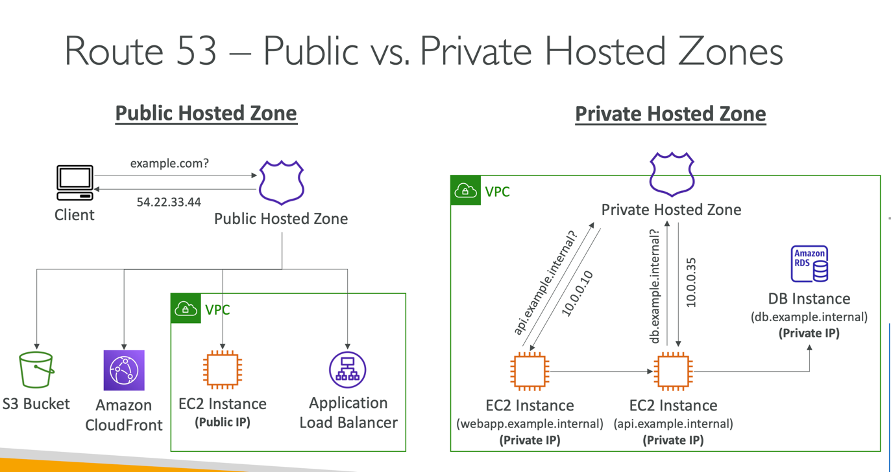
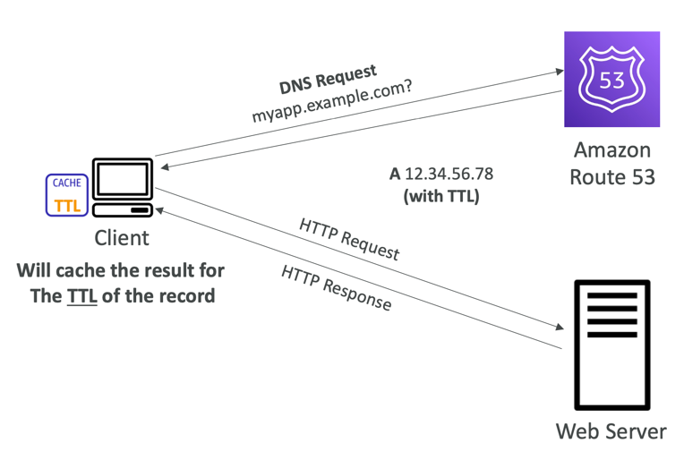

# Overview
- Route53 is a Managed DNS (Domain Name System)
- DNS is a collection of rules and records which helps clients understand how to reach a server through URLs.
- In AWS, the most common records are:
- www.google.com => 12.34.56.78 == A record (IPV4)
- www.google.com => 2001:0db8:85a3:0000:0000:8a2e:0370:7334 == AAAA IPv6
- search.google.com => www.google.com == CNAME: hostname to hostname
- example.com => AWS resource == Alias (ex: ELB, CloudFront, S3, RDS, etc...)

## DNS Terminologies
- Domain Registrar: Amazon Route 53, GoDaddy, ...
- DNS Records: A, AAAA, CNAME, NS, ...
- Zone File: contains DNS records
- Name Server: resolves DNS queries (Authoritative or Non-Authoritative)
- Top Level Domain (TLD): .com, .us, .in, .gov, .org, ...
- Second Level Domain (SLD): amazon.com, google.com, ...

## DNS work diagram

# Diagram

# Routing Policies

# Record
- How you want to route traffic for a domain
- Each record contains:
    - Domain/subdomain Name – e.g., example.com
    - Record Type – e.g., A or AAAA
    - Value – e.g., 12.34.56.78
    - Routing Policy – how Route 53 responds to queries
    - TTL – amount of time the record cached at DNS Resolvers
- Route 53 supports the following DNS record types:
    - (must know) A / AAAA / CNAME / NS
    - (advanced) CAA / DS / MX / NAPTR / PTR / SOA / TXT / SPF / SRV

## Record Types
- A – maps a hostname to IPv4
- AAAA – maps a hostname to IPv6
- CNAME – maps a hostname to another hostname
    - The target is a domain name which must have an A or AAAA record
    - Can’t create a CNAME record for the top node of a DNS namespace (Zone Apex)
    - Example: you can’t create for example.com, but you can create for www.example.com
- NS – Name Servers for the Hosted Zone
    - Control how traffic is routed for a domain

# Hosted Zone
- A container for records that define how to route traffic to a domain and its subdomains
- Public Hosted Zones – contains records that specify how to route traffic on the Internet (public domain names)application1.mypublicdomain.com
- Private Hosted Zones – contain records that specify how you route traffic within one or more VPCs (private domain names)application1.company.internal
- You pay $0.50 per month per hosted zone

# Record TTL(Time To Live)
- High TTL – e.g., 24 hr
    - Less traffic on Route 53
    - Possibly outdated records
- Low TTL – e.g., 60 sec.
    - More traffic on Route 53 ($$)
    - Records are outdated for less time
    - Easy to change records

- Except for Alias records, TTL is mandatory for each DNS record

## CNAME vs Alias