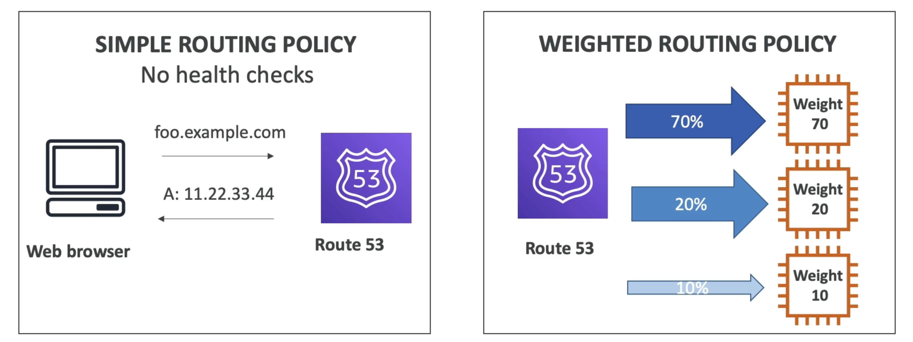
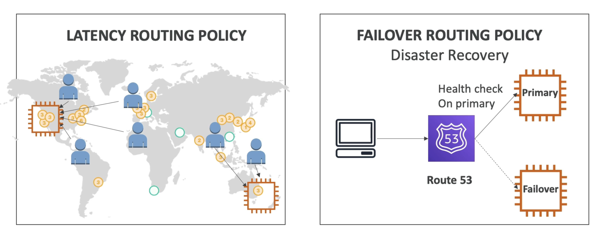

# Overview
- Route53 is a Managed DNS (Domain Name System)
- DNS is a collection of rules and records which helps clients understand how to reach a server through URLs.
- In AWS, the most common records are:
- www.google.com => 12.34.56.78 == A record (IPV4)
- www.google.com => 2001:0db8:85a3:0000:0000:8a2e:0370:7334 == AAAA IPv6
- search.google.com => www.google.com == CNAME: hostname to hostname
- example.com => AWS resource == Alias (ex: ELB, CloudFront, S3, RDS, etc...)

# Diagram

# Routing Policies

