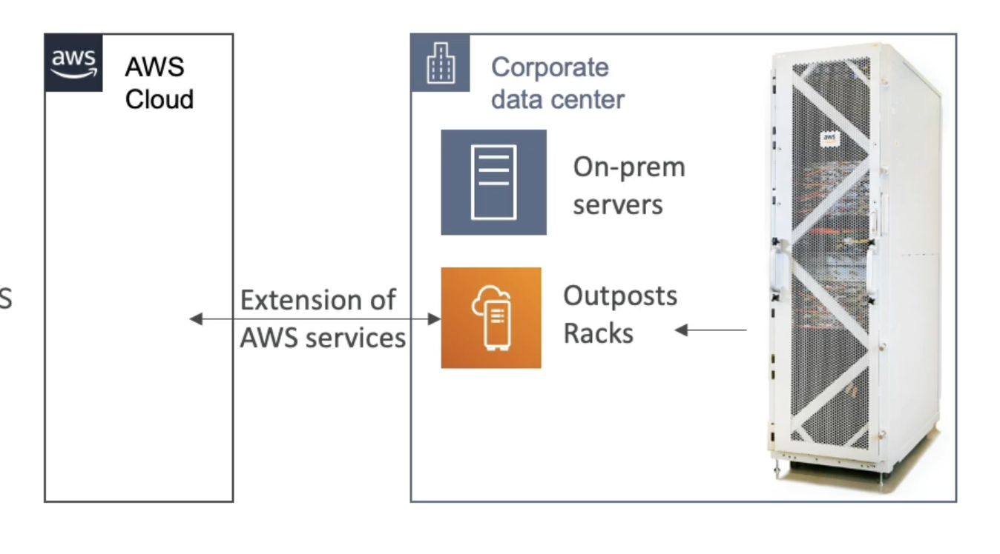

# Outpost

- Hybrid Cloud: businesses that keep an on-premises infrastructure alongside a cloud infrastructure
- Therefore, two ways of dealing with IT systems:
- One for the AWS cloud (using the AWS console, CLI, and AWS APls)
- One for their on-premises infrastructure
- AWS Outposts are "server racks" that offers the same AWS infrastructure, services, APls & tools to build your own applications on-premises just as in the cloud
- AWS will setup and manage "Outposts Racks"' within your on-premises intrastructure and you can start leveraging AWS services on-premises
- You are responsible for the Outposts Rack physical security

# Benefits
- Low-latency access to on-premises systems
- Local data processing
- Data residency
- Easier migration from on-premises to the cloud
- Fully managed service

# Some AWS services that work on Outposts
- EC2
- EBS
- RDS
- ECS
- S3
- EKS
- EMR
