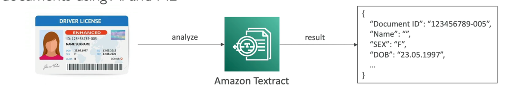

# Textract
- Automatically extracts text, handwriting, and data from any scanned documents using Al and ML

- Extract data from forms and tables
- Read and process any type of document (PDFs, images, ...)
- Use cases:
- Financial Services (e.g., invoices, financial reports)
- Healthcare (e.g., medical records, insurance claims)
- Public Sector (e.g., tax forms, ID documents, passports)