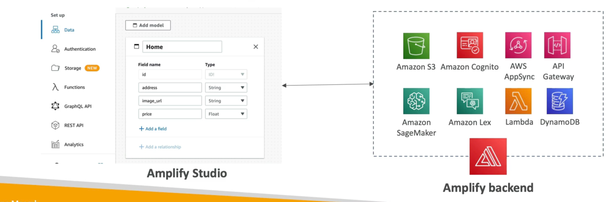

# Amplify
- A set of tools and services that helps you develop and deploy scalable full stack web and mobile applications
- Authentication, Storage, API (RES 1, GraphQL), CH/CD, Pubsub, Analytics, AI/ML Predictions, Monitoring, Source Code from AWS, GitHub, etc...
