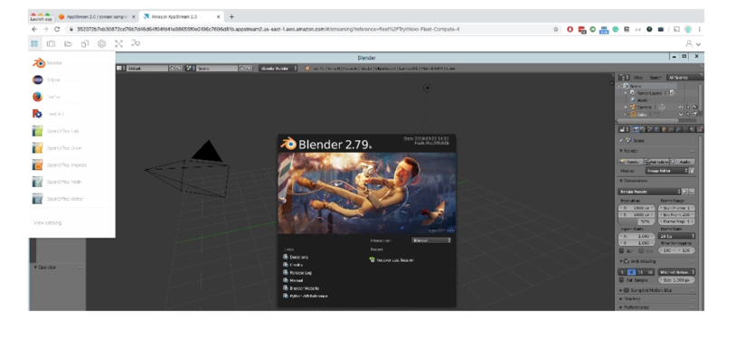

# AppStream

- Desktop Application Streaming Service
- Deliver to any computer, without acquiring, provisioning infrastructure
- The application is delivered from within a web browser

# AppStream 2.0 vs WorkSpaces
- Workspaces
- Fully managed VDI and desktop available
- The users connect to the VDI and open native or WAM applications
- Workspaces are on-demand or always on
- AppStream 2.0
- Stream a desktop application to web browsers (no need to connect to a VDI)
- Works with any device (that has a web browser)
- Allow to configure an instance type per application type (CPU, RAM, GPU)