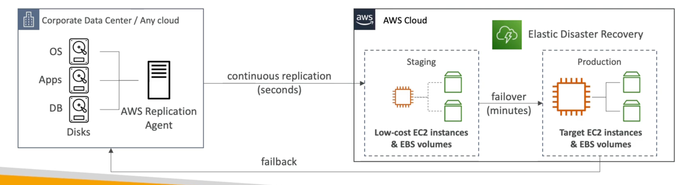

# Elastic Disaster Recovery Service (DRS)

- Used to be named "CloudEndure Disaster Recovery"
- Quickly and easily recover your physical, virtual, and cloud-based servers into AWS
- Example: protect your most critical databases (including Oracle, MySQL, and SQL Server) enterprise apps (SAP), protect your data from ransomware attacks, ...
- Continuous block-level replication for your servers