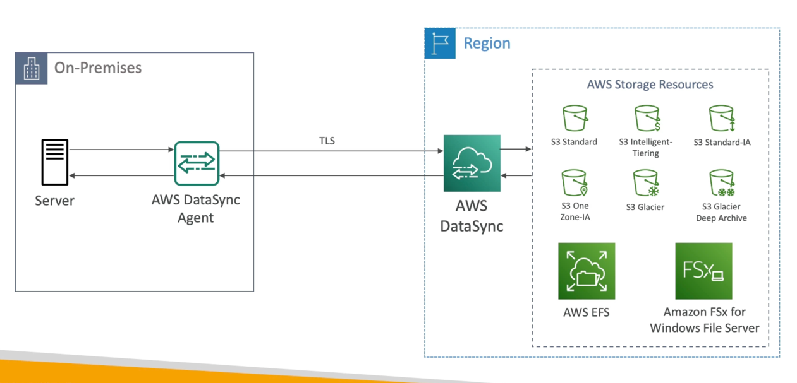

# DataSync

- Move large amount of data from on-premises to AWS
- Can synchronize to: Amazon S3 (any storage classes - including Glacier), Amazon EFS, Amazon FSx for Windows
- Replication tasks can be scheduled hourly, daily, weekly
- The replication tasks are incremental after the first full load