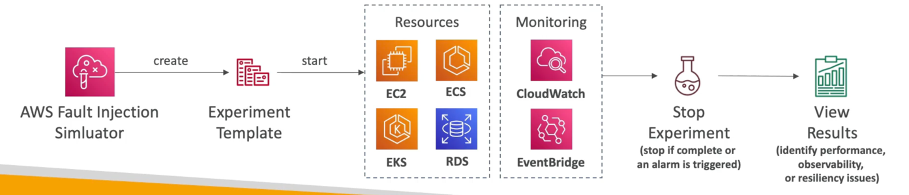

# Fault Injection Simulator(FIS)

- A fully managed service for running fault injection experiments on AWS workloads
- Based on Chaos Engineering — stressing an application by creating disruptive events (e.g., sudden increase in CPU or memory), observing how the system responds, and implementing improvements
- Helps you uncover hidden bugs and performance bottlenecks
- Supports the following AWS services: EC2, ECS, EKS, RDS...
- Use pre-built templates that generate the desired disruptions