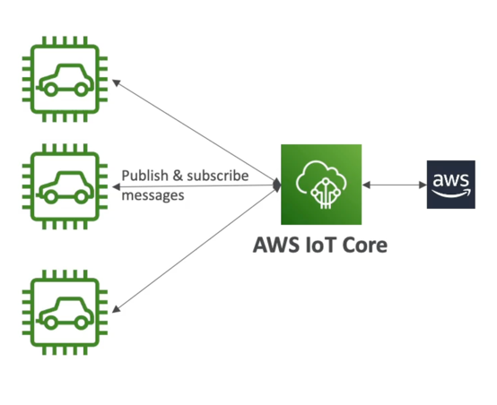

# IoT Core

- IoT stands for "Internet of Things" - the network of internet-connected devices that are able to collect and transfer data
- AWS lo I Core allows you to easily connect IoT devices to the AWS Cloud
- Serverless, secure & scalable to billions of devices and trillions of messages
- Your applications can communicate with your devices even when they aren't connectec
- Integrates with a lot of AWS services (Lambda, S3, SageMaker, etc.)
- Build loT applications that gather, process, analyze, and act on data