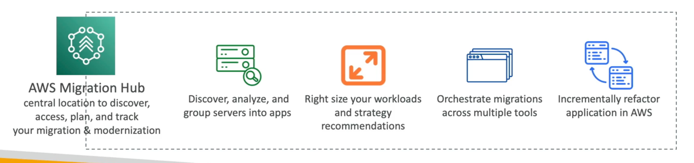

# Migration Hub

- Central location to collect servers and applications inventory data for the assessment, planning, and tracking of migrations to AWS
- Helps accelerate your migration to AWS, automate lift-and-shift
- AWS Migration Hub Orchestrator - effort migrating enterprise apps (e.g., SAP, Microsoft SQL Server...)
- Supports migrations status updates from Application Migration Service (MGN)and Database Migration Service (DMS)