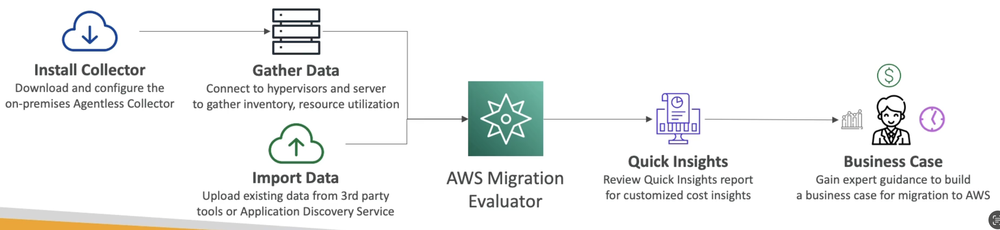

# Migration Evaluator

- Helps you build a data-driven business case for migration to AWS
- Provides a clear baseline of what your organization is running today
- Install Agentless Collector to conduct broad-based discovery
- Take a snapshot of on-premises foot-print, server dependencies, ...
- Analyze current state, define target state, then develop migration plan