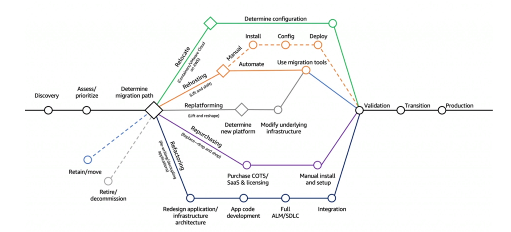

# The 7R

reference: https://aws.amazon.com/blogs/enterprise-strategy/new-possibilities-seven-strategies-to-accelerate-your-application-migration-to-aws/

## Retire
- Turn off things you don't need (maybe as a result of Re-architecting)
- Helps with reducing the surface areas for attacks (more security)
- Save cost, maybe up to 10% to 20%
- Focus your attention on resources that must be maintained
## Retain
- Do nothing for now (it's still a decision to make in a Cloud Migration)
- Security, data compliance, performance, unresolved dependencies
- No business value to migrate, mainframe or mid-range and non-x86 Unix apps
## Relocate
- Move apps from on-premises to its Cloud version
- Move EC2 instances to a different VPC, AWS account or AWS Region
- Example: transfer servers from VMware Software-defined Data Center (SSDC) to VMware Cloud on AWS
## Rehost "lift and shift"
- Simple migrations by re-hosting on AWS (applications, databases, data...)
- Migrate machines (physical, virtual, another Cloud) to AWS Cloud
- No cloud optimizations being done, applications is migrated as is
- Could save as much as 30% on cost
- Example: Migrate using AWS Application Migration Service
## Replatform "lift and reshape"
- Example: migrate your database to RDS
- Example: migrate your application to Elastic Beanstalk
- Not changing the core architecture, but leverage some Cloud optimizations
- Save time and money by moving to a fully managed service or Serverless
## Repurchase "drop and shop"
- Moving to a different product while moving to the Cloud
- Often you move to a SaaS platform
- Expensive in the short term, but quick to deploy
- Example: CRM to Salesforce.com, HR to Workday, CMS to Drupal
## Refactor / Re-architect
- Reimagining how the application is architected using Cloud Native features
- Driven by the need of the business to add features and improve scalability, performance, security, and agility
- Move from a monolithic application to micro-services
- Example: move an application to Serverless architectures, use AWS S3
