# Use Case
- Backup and storage
- Disaster Recovery
- Archive
- Hybrid Cloud storage
- Application hosting
- Media hosting
- Data lakes & big data analytics
- Software delivery
- Static website

# Bucket
- Amazon S3 allows people to store objects (files) in "buckets" (directories)
- Buckets must have a globally unique name (across all regions all accounts)
- Buckets are defined at the region level
- S3 looks like a global service but buckets are created in a region

# Objects
- Objects (files) have a Key
- The key is the FULL path:
    - s3://my-bucket/my_file.txt
    - s3://my-bucket/my_folderl/another_folder/my_file.txt
- The key is composed of prefix + object name
    - s3://my-bucket/my_folder|/another_folder/my_file.txt
- There's no concept of "directories" within buckets (although the Ul will trick you to think otherwise)

## Contain
- Object values are the content of the body:
- Max. Object Size is 5TB (5000GB)
- If uploading more than 5GB, must use "multi-part upload"
- Metadata (list of text key / value pairs - system or user metadata)
- Tags (Unicode key / value pair - up to 10) - useful for security / lifecycle
- Version ID (if versioning is enabled)

# Security
## User-Based
- IAM Policies - which API calls should be allowed for a specific user from IAM
## Resource-Based
- Bucket Policies - bucket wide rules from the S3 console - allows cross account
- Object Access Control List (ACL) - finer grain (can be disabled)
- Bucket Access Control List (ACL) - less common (can be disabled)
## Note: an IAM principal can access an S3 object if
- The user IAM permissions ALLOW it OR the resource policy ALLOWS it
- AND there's no explicit DENY
## Encryption: encrypt objects in Amazon S3 using encryption keys

# S3 bucket policies
- JSON based policies
    - Resources: buckets and objects
    - Effect: Allow / Deny
    - Actions: Set of APl to Allow or Deny
    - Principal: The account or user to apply the policy to
- Use S3 bucket for policy to:
    - Grant public access to the bucket
    - Force objects to be encrypted at upload
    - Grant access to another account (Cross Account)

# S3 Static Website
- You need to make all buket to public so that you can access the website.

# S3 Versioning
- You can version your files in Amazon S3
- It is enabled at the bucket level
- Same key overwrite will change the "version": 1, 2,3....
- It is best practice to version your buckets
- Protect against unintended deletes (ability to restore a version)
- Easy roll back to previous version
## Notes:
- Any file that is not versioned prior to enabling versioning will have version "null"
- Suspending versioning does not delete the previous versions
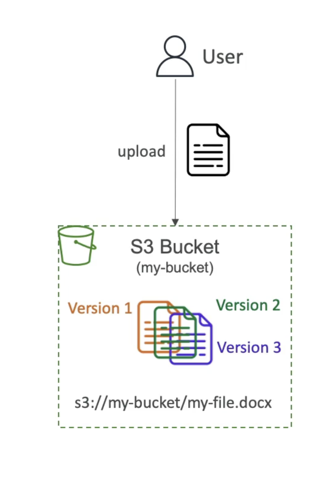

# S3 Replication (CRR & SRR)
- Must enable Versioning in source and destination buckets
- Cross-Region Replication (CRR)
- Same-Region Replication (SRR)
- Buckets can be in different AWS accounts
- Copying is asynchronous
- Must give proper IAM permissions to S3 asynchronous replication
- Use cases:
- CRR - compliance, lower latency access, replication across accounts
- SRR - log aggregation, live replication between production and test

# S3 Storage Classes
## Amazon S3 Standard - General Purpose
- 99.99% Availability
- Used for frequently accessed data
- Low latency and high throughput
- Sustain 2 concurrent facility failures
- Use Cases: Big Data analytics, mobile & gaming applications, content distribution...
---
- For data that is less frequently accessed, but requires rapid access when needed
- Lower cost than S3 Standard
## Amazon S3 Standard-Infrequent Access (IA)
- 99.9% Availability
- Use cases: Disaster Recovery, backups
## Amazon S3 One Zone-Infrequent Access
- High durability (99.999999999%) in a single AZ; data lost when AZ is destroyed
- 99.5% Availability
---
- Low-cost object storage meant for archiving / backup
- Pricing: price for storage + object retrieval cost
## Amazon S3 Glacier Instant Retrieval
- Millisecond retrieval, great for data accessed once a quarter
- Minimum storage duration of 90 days
## Amazon S3 Glacier Flexible Retrieval
- Expedited (I to 5 minutes), Standard (3 to 5 hours), Bulk (5 to 12 hours) - free
- Minimum storage duration of 90 days
## Amazon S3 Glacier Deep Archive
- Standard (12 hours), Bulk (48 hours)
- Minimum storage duration of 180 days
---
## Amazon S3 Intelligent Tiering
- Small monthly monitoring and auto-tiering fee
- Moves objects automatically between Access Tiers based on usage
- There are no retrieval charges in S3 Intelligent-Tiering
- Frequent Access tier (automatic): default tier
- Infrequent Access tier (automatic): objects not accessed for 30 days
- Archive Instant Access tier (automatic): objects not accessed for 90 days
- Archive Access tier (optional): configurable from 90 days to 700+ days
- Deep Archive Access tier (optional): config. from 180 days to 700+ days

- Can move between classes manually or using S3 Lifecycle configurations

# Durability and Availability
## Durability:
- High durability (99.999999999%, 1 | 9's) of objects across multiple AZ
- If you store 10,000,000 objects with Amazon S3, you can on average expect to incur a loss of a single object once every 10,000 years
- Same for all storage classes
## Availability:
- Measures how readily available a service is
- Varies depending on storage class
- Example: S3 standard has 99.99% availability = not available 53 minutes a year

# Encryption
## Server side encryption
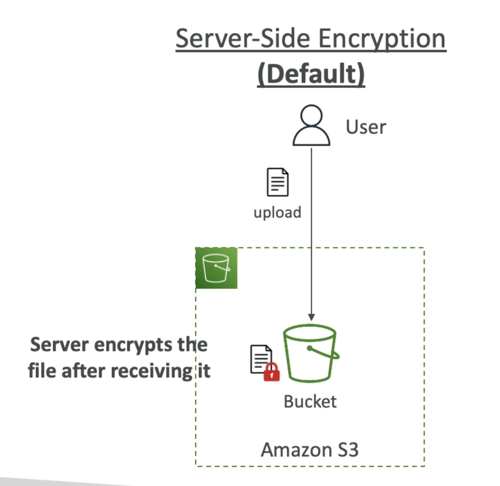
## Client side encryption

# IAM access analyzer for S3
- Ensures that only intended people have access to your S3 buckets
- Example: publicly accessible bucket, bucket shared with other AWS account...
- Evaluates S3 Bucket Policies, S3 ACLs, S3 Access Point Policies
- Powered by IAM Access Analyzer

# Share Responsibility Model for S3
## AWS responsibility:
- Infrastructure (global security, durability, availability, sustain concurrent loss of data in two facilities)
- Configuration and vulnerability analysis
- Compliance validation
## Customer responsibility:
- S3 Versioning
- S3 Bucket Policies
- S3 Replication Setup
- Logging and Monitoring
- S3 Storage Classes
- Data encryption at rest and in transit

## Moving between Storage Classes
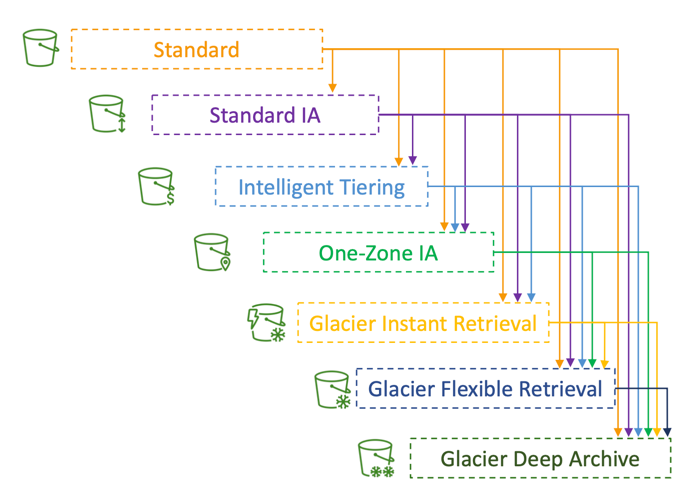
• You can transition objects between storage classes
• For infrequently accessed object, move them to Standard IA
• For archive objects that you don’t need fast access to, move them to Glacier or Glacier Deep Archive
• Moving objects can be automated using a Lifecycle Rules

## Lifecycle Rules
• Transition Actions – configure objects to transition to another storage class
  • Move objects to Standard IA class 60 days after creation
  • Move to Glacier for archiving after 6 months
• Expiration actions – configure objects to expire (delete) after some time
  • Access log files can be set to delete after a 365 days
  • Can be used to delete old versions of files (if versioning is enabled)
  • Can be used to delete incomplete Multi-Part uploads
• Rules can be created for a certain prefix (example: s3://mybucket/mp3/*)
• Rules can be created for certain objects Tags (example: Department: Finance)

### Scenario 1: Lifecycle Rule
Your application on EC2 creates images thumbnails after profile
photos are uploaded to Amazon S3. These thumbnails can be easily
recreated, and only need to be kept for 60 days. The source images
should be able to be immediately retrieved for these 60 days, and
afterwards, the user can wait up to 6 hours. How would you design
this?
• S3 source images can be on Standard, with a lifecycle configuration to
transition them to Glacier after 60 days
• S3 thumbnails can be on One-Zone IA, with a lifecycle configuration to
expire them (delete them) after 60 days

### Scenario 2: Lifecycle Rule
• A rule in your company states that you should be able to recover your
deleted S3 objects immediately for 30 days, although this may happen
rarely. After this time, and for up to 365 days, deleted objects should
be recoverable within 48 hours.
• Enable S3 Versioning in order to have object versions, so that “deleted
objects” are in fact hidden by a “delete marker” and can be recovered
• Transition the “noncurrent versions” of the object to Standard IA
• Transition afterwards the “noncurrent versions” to Glacier Deep Archive

## Analytics
### S3 Storage Class Analysis
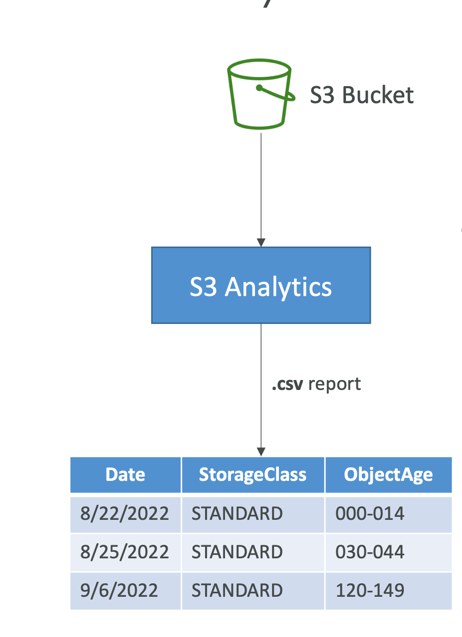
• Help you decide when to transition objects to the right storage class
• Recommendations for Standard and Standard IA
• Does NOT work for One-Zone IA or Glacier
• Report is updated daily
• 24 to 48 hours to start seeing data analysis
• Good first step to put together Lifecycle Rules(or improve them)!

## Requester Pays
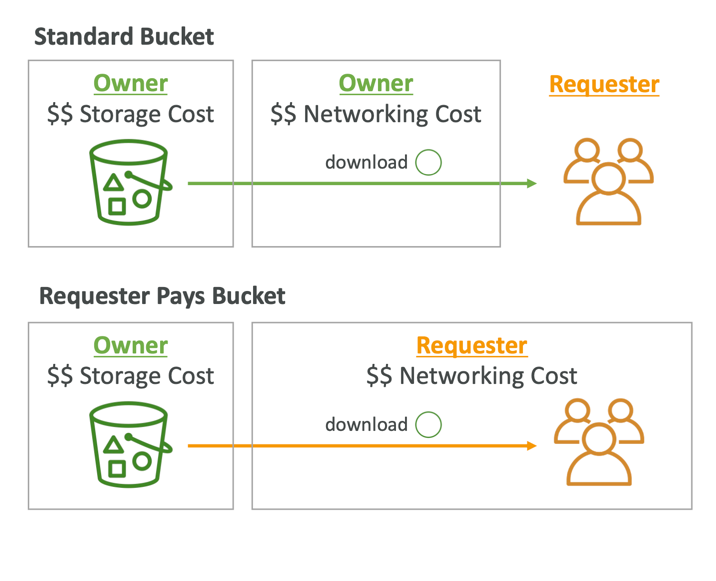
• In general, bucket owners pay for all Amazon S3 storage and data transfer costs associated with their bucket
• With Requester Pays buckets, the requester instead of the bucket owner pays the cost of the request and the data download from the bucket
• Helpful when you want to share large datasets with other accounts
• The requester must be authenticated in AWS (cannot be anonymous)

## S3 Event Notifications
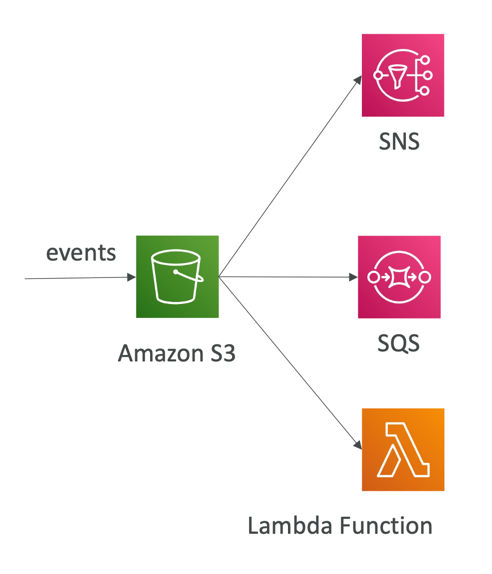
• S3:ObjectCreated, S3:ObjectRemoved, 
S3:ObjectRestore, S3:Replication…
• Object name filtering possible (*.jpg)
• Use case: generate thumbnails of images uploaded to S3
• Can create as many “S3 events” as desired
• S3 event notifications typically deliver events in seconds but can sometimes take a minute or longer
### IAM Permissions
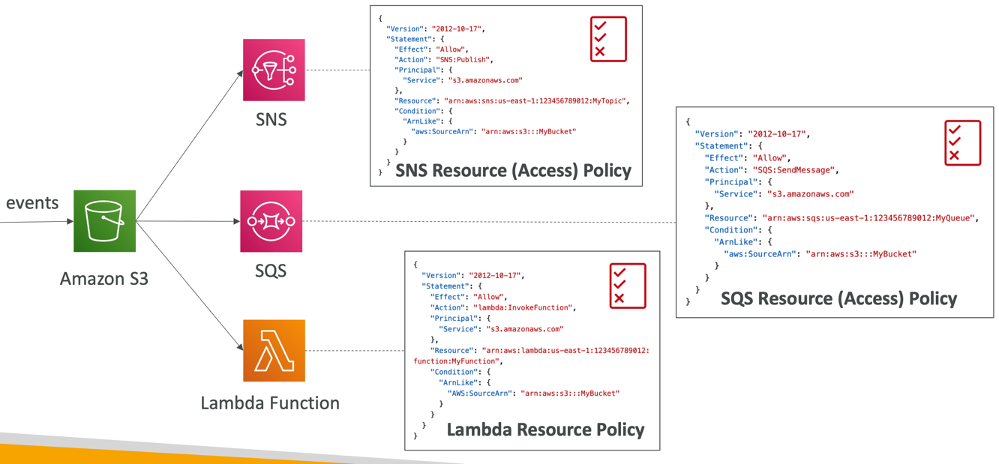

### With Event Bridge
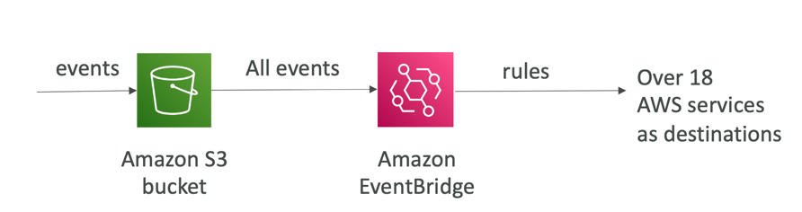
• Advanced filtering options with JSON rules (metadata, object size, name...)
• Multiple Destinations – ex Step Functions, Kinesis Streams / Firehose…
• EventBridge Capabilities – Archive, Replay Events, Reliable delivery

## Baseline Performance
• Amazon S3 automatically scales to high request rates, latency 100-200 ms
• Your application can achieve at least 3,500 PUT/COPY/POST/DELETE or 5,500 GET/HEAD requests per second per prefix in a bucket.
• There are no limits to the number of prefixes in a bucket.
• Example (object path => prefix):
  • bucket/folder1/sub1/file => /folder1/sub1/
  • bucket/folder1/sub2/file => /folder1/sub2/
  • bucket/1/file => /1/
  • bucket/2/file => /2/
• If you spread reads across all four prefixes evenly, you can achieve 22,000 requests per second for GET and HEAD

## Performance 
### Multi-Part Upload
• recommended for files > 100MB, must use for files > 5GB
• Can help parallelize uploads (speed up transfers)
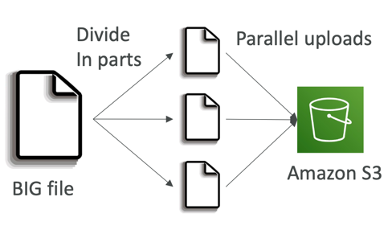

### S3 Transfer Acceleration
• Increase transfer speed by transferring file to an AWS edge location which will forward the data to the S3 bucket in the target region
• Compatible with multi-part upload
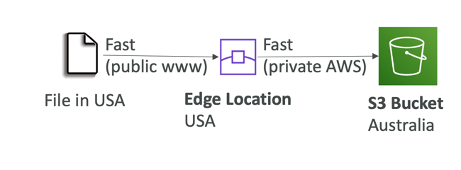

### S3 Byte-Range Fetches
- Parallelize GETs by requesting specific byte ranges
- Better resilience in case of failures
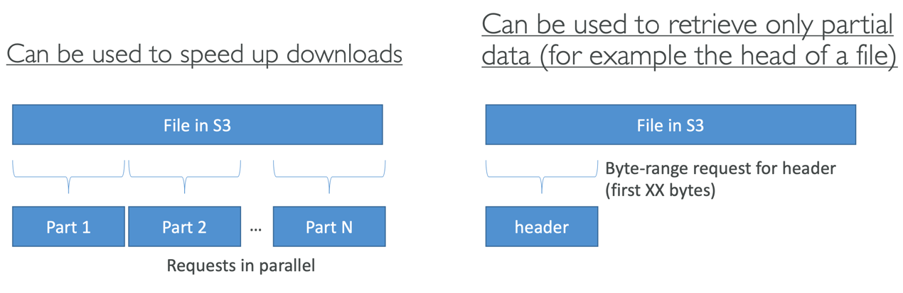

### Batch Operations
• Perform bulk operations on existing S3 objects with a single request, example:
  • Modify object metadata & properties
  • Copy objects between S3 buckets
  • Encrypt un-encrypted objects
  • Modify ACLs, tags
  • Restore objects from S3 Glacier
  • Invoke Lambda function to perform custom action on each object
• A job consists of a list of objects, the action to perform , optional parameters  

## S3 Storage Lens
- Understand, analyze, and optimize storage across entire AWS Organization
• Discover anomalies, identify cost efficiencies, and apply data protection best practices across entire AWS Organization (30 days usage & activity metrics)
• Aggregate data for Organization, specific accounts, regions, buckets, or prefixes
• Default dashboard or create your own dashboards
• Can be configured to export metrics daily to an S3 bucket (CSV, Parquet)
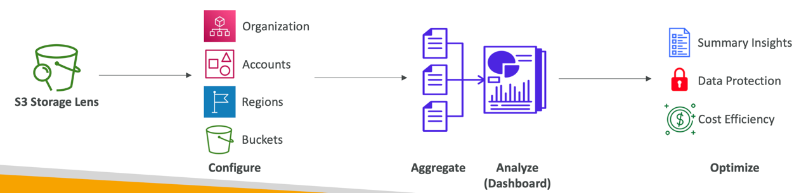

