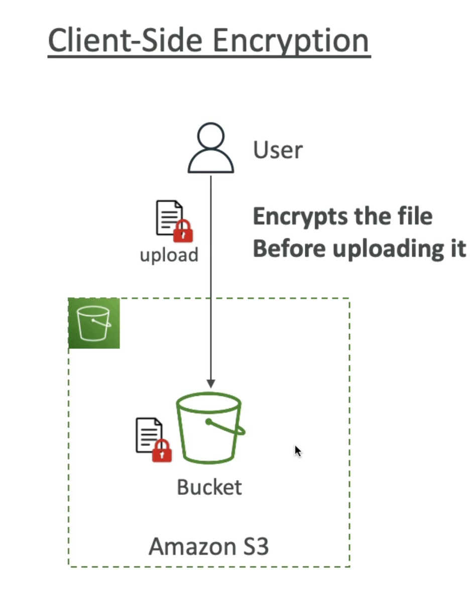

# Use Case
- Backup and storage
- Disaster Recovery
- Archive
- Hybrid Cloud storage
- Application hosting
- Media hosting
- Data lakes & big data analytics
- Software delivery
- Static website

# Bucket
- Amazon S3 allows people to store objects (files) in "buckets" (directories)
- Buckets must have a globally unique name (across all regions all accounts)
- Buckets are defined at the region level
- S3 looks like a global service but buckets are created in a region

# Objects
- Objects (files) have a Key
- The key is the FULL path:
    - s3://my-bucket/my_file.txt
    - s3://my-bucket/my_folderl/another_folder/my_file.txt
- The key is composed of prefix + object name
    - s3://my-bucket/my_folder|/another_folder/my_file.txt
- There's no concept of "directories" within buckets (although the Ul will trick you to think otherwise)

## Contain
- Object values are the content of the body:
- Max. Object Size is 5TB (5000GB)
- If uploading more than 5GB, must use "multi-part upload"
- Metadata (list of text key / value pairs - system or user metadata)
- Tags (Unicode key / value pair - up to 10) - useful for security / lifecycle
- Version ID (if versioning is enabled)

# Security
## User-Based
- IAM Policies - which API calls should be allowed for a specific user from IAM
## Resource-Based
- Bucket Policies - bucket wide rules from the S3 console - allows cross account
- Object Access Control List (ACL) - finer grain (can be disabled)
- Bucket Access Control List (ACL) - less common (can be disabled)
## Note: an IAM principal can access an S3 object if
- The user IAM permissions ALLOW it OR the resource policy ALLOWS it
- AND there's no explicit DENY
## Encryption: encrypt objects in Amazon S3 using encryption keys

# S3 bucket policies
- JSON based policies
    - Resources: buckets and objects
    - Effect: Allow / Deny
    - Actions: Set of APl to Allow or Deny
    - Principal: The account or user to apply the policy to
- Use S3 bucket for policy to:
    - Grant public access to the bucket
    - Force objects to be encrypted at upload
    - Grant access to another account (Cross Account)

# S3 Static Website
- You need to make all buket to public so that you can access the website.

# S3 Versioning
- You can version your files in Amazon S3
- It is enabled at the bucket level
- Same key overwrite will change the "version": 1, 2,3....
- It is best practice to version your buckets
- Protect against unintended deletes (ability to restore a version)
- Easy roll back to previous version
## Notes:
- Any file that is not versioned prior to enabling versioning will have version "null"
- Suspending versioning does not delete the previous versions

# S3 Replication (CRR & SRR)
- Must enable Versioning in source and destination buckets
- Cross-Region Replication (CRR)
- Same-Region Replication (SRR)
- Buckets can be in different AWS accounts
- Copying is asynchronous
- Must give proper IAM permissions to S3 asynchronous replication
- Use cases:
- CRR - compliance, lower latency access, replication across accounts
- SRR - log aggregation, live replication between production and test

# S3 Storage Classes
## Amazon S3 Standard - General Purpose
- 99.99% Availability
- Used for frequently accessed data
- Low latency and high throughput
- Sustain 2 concurrent facility failures
- Use Cases: Big Data analytics, mobile & gaming applications, content distribution...
---
- For data that is less frequently accessed, but requires rapid access when needed
- Lower cost than S3 Standard
## Amazon S3 Standard-Infrequent Access (IA)
- 99.9% Availability
- Use cases: Disaster Recovery, backups
## Amazon S3 One Zone-Infrequent Access
- High durability (99.999999999%) in a single AZ; data lost when AZ is destroyed
- 99.5% Availability
---
- Low-cost object storage meant for archiving / backup
- Pricing: price for storage + object retrieval cost
## Amazon S3 Glacier Instant Retrieval
- Millisecond retrieval, great for data accessed once a quarter
- Minimum storage duration of 90 days
## Amazon S3 Glacier Flexible Retrieval
- Expedited (I to 5 minutes), Standard (3 to 5 hours), Bulk (5 to 12 hours) - free
- Minimum storage duration of 90 days
## Amazon S3 Glacier Deep Archive
- Standard (12 hours), Bulk (48 hours)
- Minimum storage duration of 180 days
---
## Amazon S3 Intelligent Tiering
- Small monthly monitoring and auto-tiering fee
- Moves objects automatically between Access Tiers based on usage
- There are no retrieval charges in S3 Intelligent-Tiering
- Frequent Access tier (automatic): default tier
- Infrequent Access tier (automatic): objects not accessed for 30 days
- Archive Instant Access tier (automatic): objects not accessed for 90 days
- Archive Access tier (optional): configurable from 90 days to 700+ days
- Deep Archive Access tier (optional): config. from 180 days to 700+ days

- Can move between classes manually or using S3 Lifecycle configurations

# Durability and Availability
## Durability:
- High durability (99.999999999%, 1 | 9's) of objects across multiple AZ
- If you store 10,000,000 objects with Amazon S3, you can on average expect to incur a loss of a single object once every 10,000 years
- Same for all storage classes
## Availability:
- Measures how readily available a service is
- Varies depending on storage class
- Example: S3 standard has 99.99% availability = not available 53 minutes a year

# Encryption
## Server side encryption

## Client side encryption

# IAM access analyzer for S3
- Ensures that only intended people have access to your S3 buckets
- Example: publicly accessible bucket, bucket shared with other AWS account...
- Evaluates S3 Bucket Policies, S3 ACLs, S3 Access Point Policies
- Powered by IAM Access Analyzer

# Share Responsibility Model for S3
## AWS responsibility:
- Infrastructure (global security, durability, availability, sustain concurrent loss of data in two facilities)
- Configuration and vulnerability analysis
- Compliance validation
## Customer responsibility:
- S3 Versioning
- S3 Bucket Policies
- S3 Replication Setup
- Logging and Monitoring
- S3 Storage Classes
- Data encryption at rest and in transit