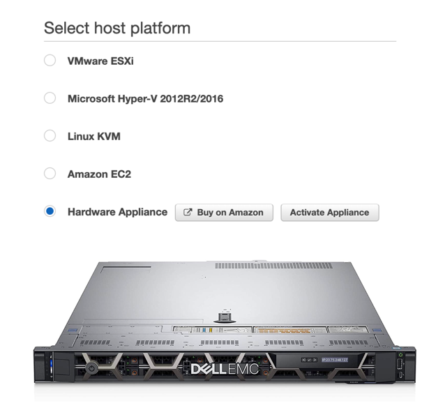
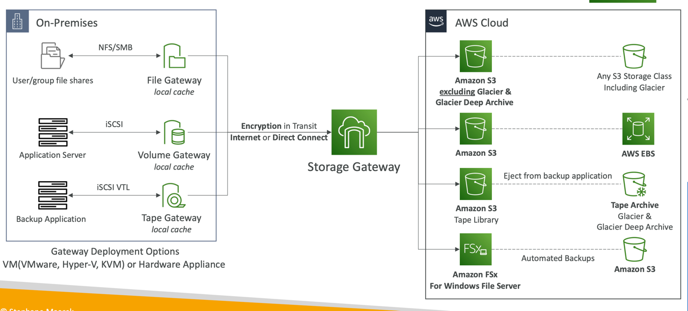

# Introduction
- AWS is pushing for "hybrid cloud"
    - Part of your infrastructure is on-premises
    - Part of your infrastructure is on the cloud
- This can be due to
    - Long cloud migrations
    - Security requirements
    - Compliance requirements
    - IT strategy
- S3 is a proprietary storage technology (unlike EFS / NFS), so how do you expose the S3 data on-premise?

- Bridge between on-premises data and cloud data
- Use cases:
  - disaster recovery
  - backup & restore
  - tiered storage
  - on-premises cache & low-latency files access
- Types of Storage Gateway:
  - S3 File Gateway
  - FSx File Gateway
  - Volume Gateway
  - Tape Gateway

## AWS Storage Cloud Native Options

### S3 File Gateway
- Configured S3 buckets are accessible using the NFS and SMB protocol
- Most recently used data is cached in the file gateway
- Supports S3 Standard, S3 Standard IA, S3 One Zone A, S3 Intelligent Tiering
- Transition to S3 Glacier using a Lifecycle Policy
- Bucket access using IAM roles for each File Gateway
- SMB Protocol has integration with Active Directory (AD) for user authentication

### FSx File Gateway
- Native access to Amazon FSx for Windows File Server
- Local cache for frequently accessed data
- Windows native compatibility (SMB, NTFS, Active Directory...)
- Useful for group file shares and home directories

### Volume Gateway
- Block storage using iSCSI protocol backed by S3
- Backed by EBS snapshots which can help restore on-premises volumes!
- Cached volumes: low latency access to most recent data
- Stored volumes: entire dataset is on premise, scheduled backups to S3

### Tape Gateway
- Some companies have backup processes using physical tapes (!)
- With Tape Gateway, companies use the same processes but, in the cloud
- Virtual Tape Library (VTL) backed by Amazon S3 and Glacier
- Back up data using existing tape-based processes (and iSCSI interface)
- Works with leading backup software vendors

## Storage Gateway – Hardware appliance
- Using Storage Gateway means you need on-premises virtualization
- Otherwise, you can use a Storage Gateway Hardware Appliance
- You can buy it on amazon.com
- Works with File Gateway, Volume Gateway, Tape Gateway
- Has the required CPU, memory, network, SSD cache resources
- Helpful for daily NFS backups in small data centers

## Storage Gateway Summary
