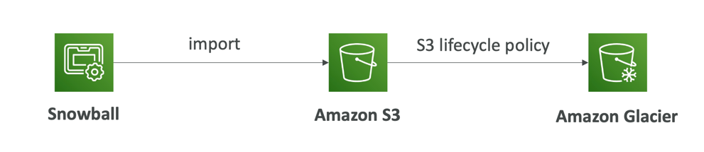

# Introduction
- Highly-secure, portable devices to collect and process data at the edge, and migrate data into and out of AWS
- Helps migrate up to Petabytes of data

# use in edge computing
- Process data while it's being created on an edge location
- A truck on the road, a ship on the sea, a mining station underground...
- These locations may have limited internet and no access to computing power
- We setup a Snowball Edge device to do edge computing
- Snowball Edge Compute Optimized (dedicated for that use case) & Storage Optimized
- Run EC2 Instances or Lambda functions at the edge
- Use cases: preprocess data, machine learning, transcoding media

# Snowball Pricing
- You pay for device usage and data transfer out of AWS
- Data transfer IN to Amazon S3 is $0.00 per GB
- On-Demand
    - Includes a one-time service fee per job, which includes:
        - 10 days of usage for Snowball Edge Storage Optimized 80TB
        - 15 days of usage for Snowball Edge Storage Optimized 210TB
    - Shipping days are NOT counted towards the included 10 or 15 days
    - Pay per day for any additional days
- Committed Upfront
    - Pay in advance for monthly, I-year, and 3-years of usage (Edge Computing)
    - Up to 62% discounted pricing

# Solution Architecture: Snowball into Glacier
- Snowball cannot import to Glacier directly
- You must use Amazon S3 first, in combination with an S3 lifecycle policy

