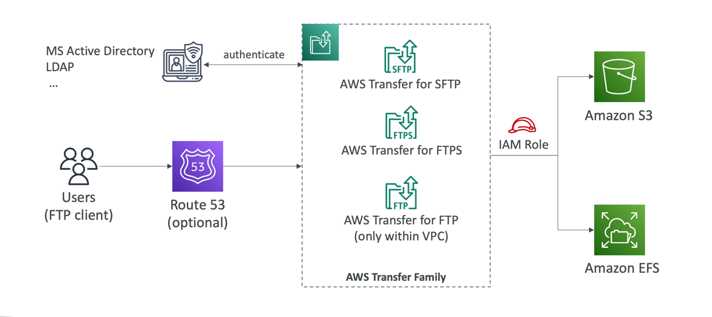
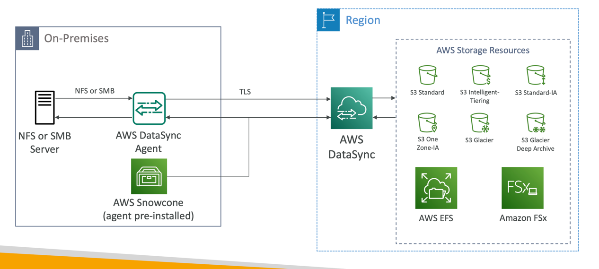
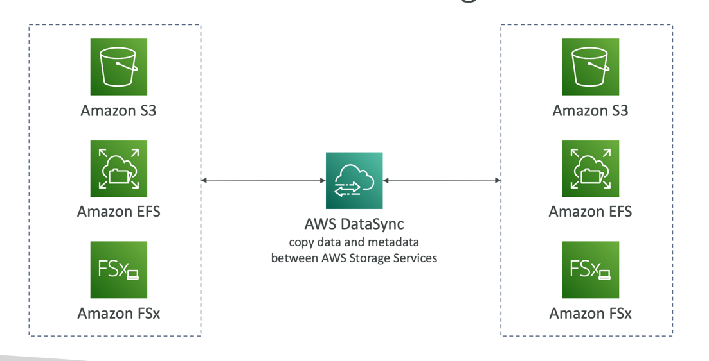

# Transfer Family
## Introduction  
- Amazon EFS using the FTP protocol
- Supported Protocols
    - AWS Transfer for FTP (File Transfer Protocol (FTP))
    - AWS Transfer for FTPS (File Transfer Protocol over SSL (FTPS))
    - AWS Transfer for SFTP (Secure File Transfer Protocol (SFTP))
- Managed infrastructure, Scalable, Reliable, Highly Available (multi-AZ)
- Pay per provisioned endpoint per hour + data transfers in GB
- Store and manage users’ credentials within the service
- Integrate with existing authentication systems (Microsoft Active Directory, LDAP, Okta, Amazon Cognito, custom)
- Usage: sharing files, public datasets, CRM, ERP, ...

## AWS DataSync
- Move large amount of data to and from
- On-premises / other cloud to AWS (NFS, SMB, HDFS, S3 API…) – needs agent
- AWS to AWS (different storage services) – no agent needed
- Can synchronize to:
- Amazon S3 (any storage classes – including Glacier)
- Amazon EFS
- Amazon FSx (Windows, Lustre, NetApp, OpenZFS...)
- Replication tasks can be scheduled hourly, daily, weekly
- File permissions and metadata are preserved (NFS POSIX, SMB…)
- One agent task can use 10 Gbps, can setup a bandwidth limit

## AWS DataSync NFS / SMB to AWS (S3, EFS, FSx…)

## AWS DataSync Transfer between AWS storage services

