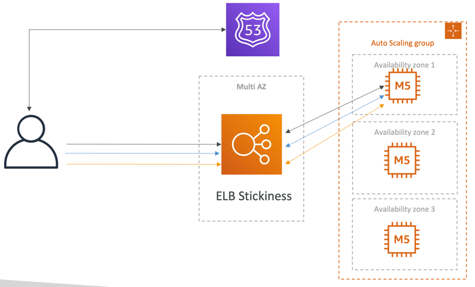
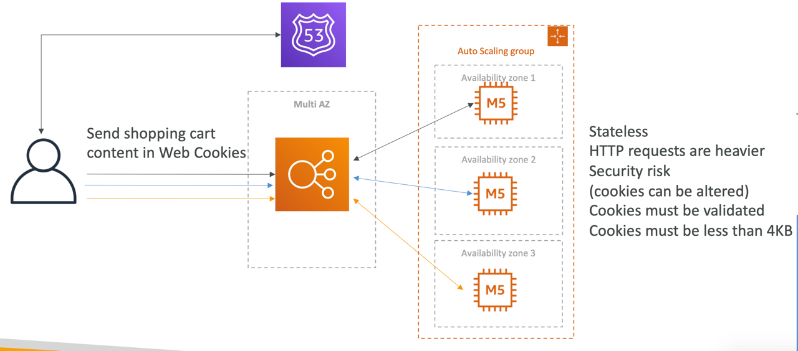
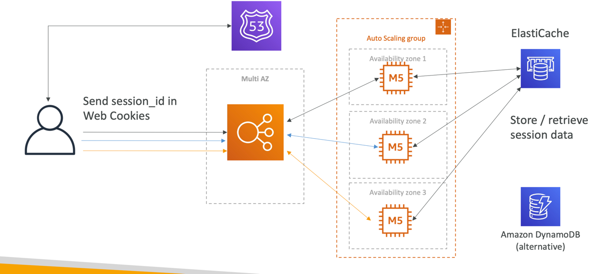
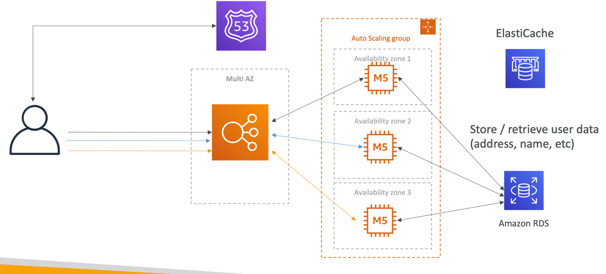
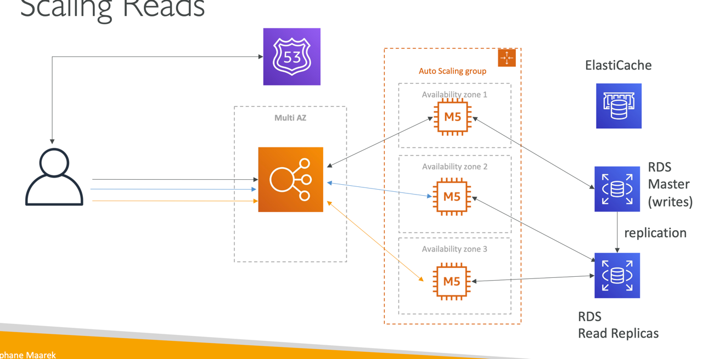
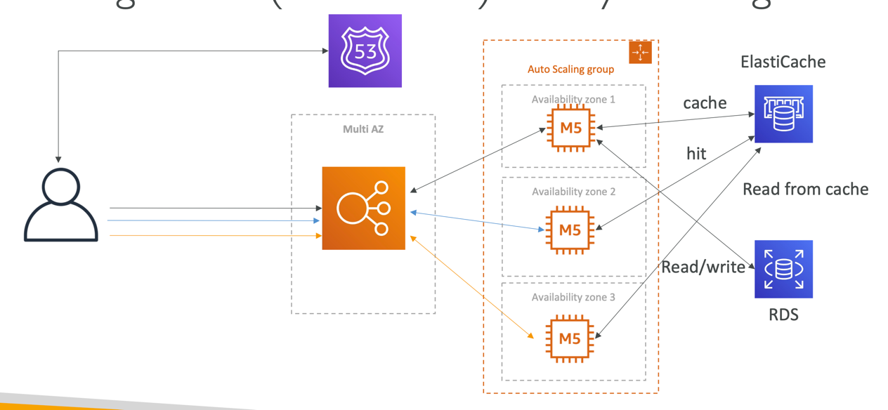
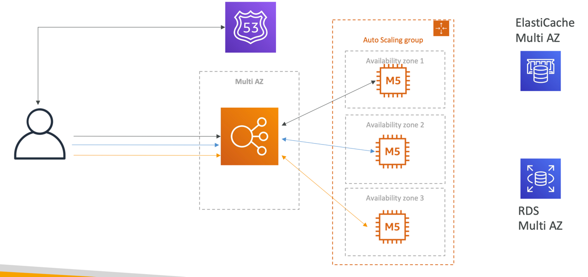
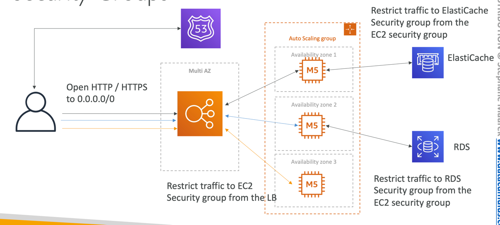

# Stateful Web App: MyClothes.com
- MyClothes.com allows people to buy clothes online.
- There’s a shopping cart
- Our website is having hundreds of users at the same time
- We need to scale, maintain horizontal scalability and keep our web application as stateless as possible
- Users should not lose their shopping cart
- Users should have their details (address, etc) in a database
- Let’s see how we can proceed!

## Introduce Stickiness (Session Affinity)

## Introduce User Cookies

## Introduce Server Session

## Storing User Data in a database

## Scaling Reads

## Scaling Reads (Alternative) – Lazy Loading

## Multi AZ – Survive disasters

## Security Groups

In this lecture we’ve discussed…
3-tier architectures for web applications
- ELB sticky sessions
- Web clients for storing cookies and making our web app stateless
- ElastiCache
- For storing sessions (alternative: DynamoDB)
- For caching data from RDS
- Multi AZ
- RDS
- For storing user data
- Read replicas for scaling reads
- Multi AZ for disaster recovery
- Tight Security with security groups referencing each other