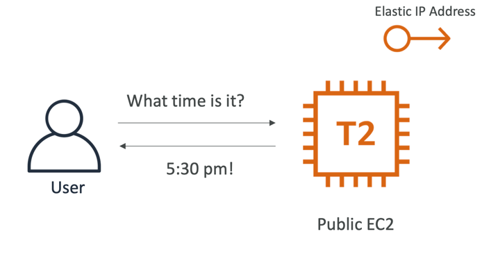
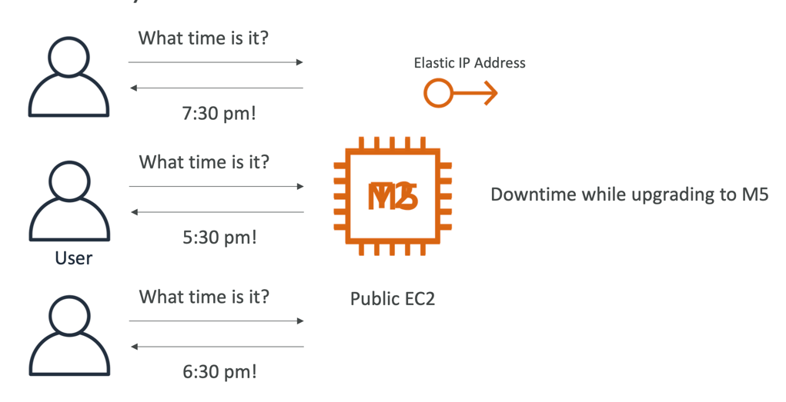
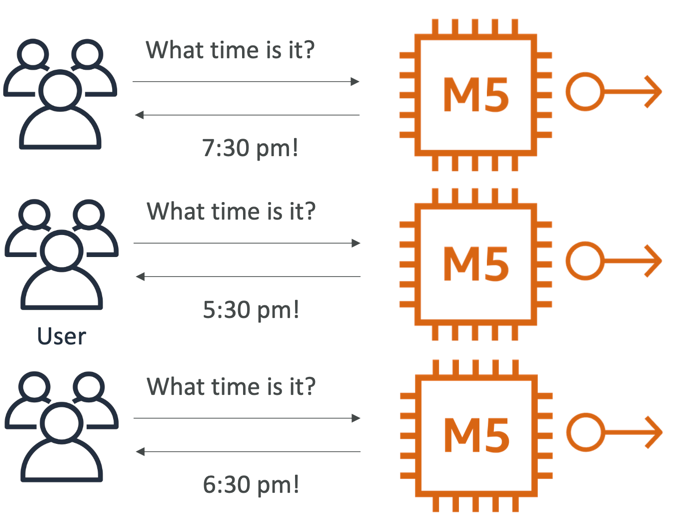
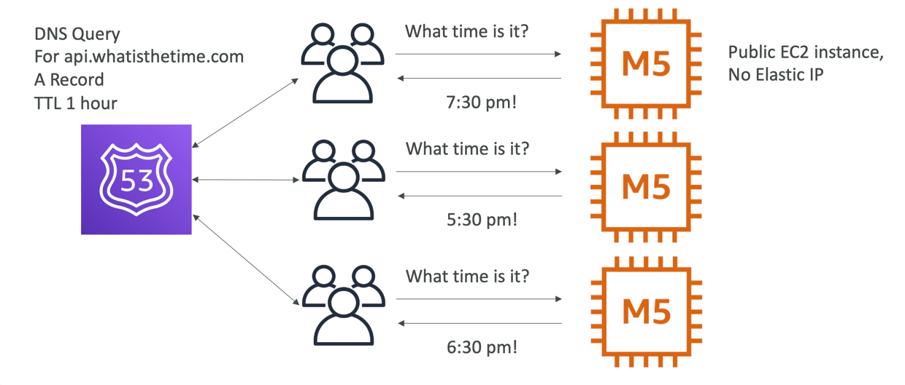
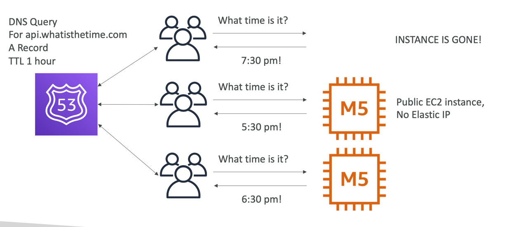
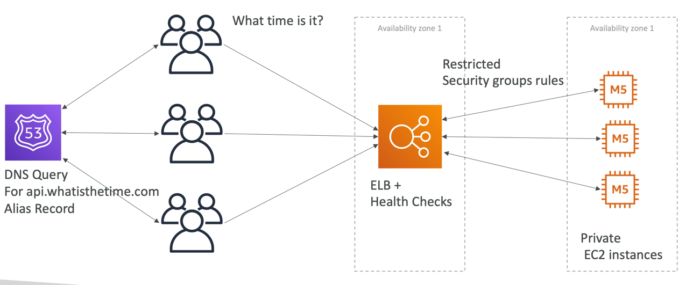
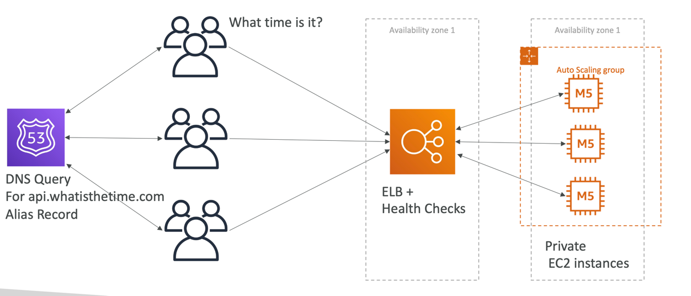
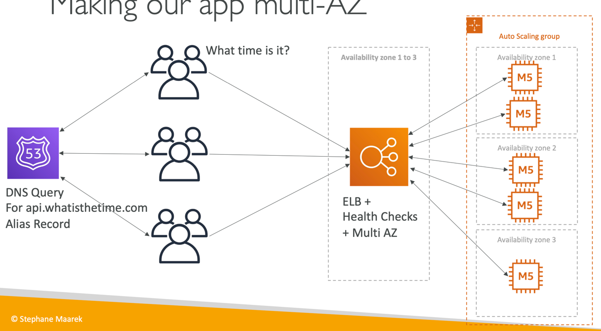
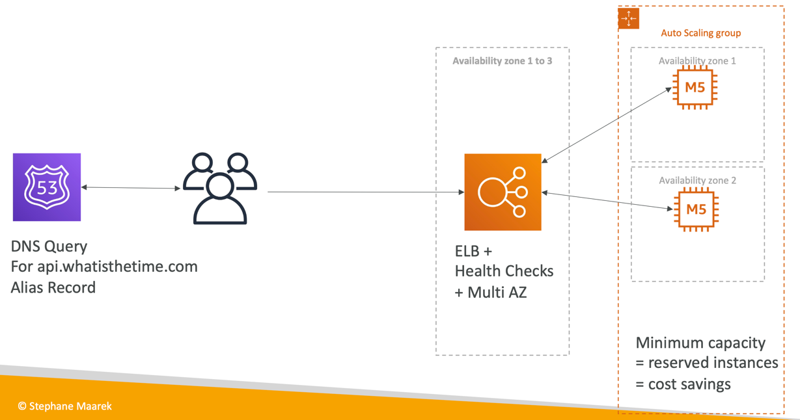

# What is the time app
- WhatIsTheTime.com allows people to know what time it is
- We don’t need a database
- We want to start small and can accept downtime
- We want to fully scale vertically and horizontally, no downtime
- Let’s go through the Solutions Architect journey for this app
- Let’s see how we can proceed!

## Starting simple

## Scaling vertically

## Scaling horizontally

## Scaling horizontally, with a load balancer

## Scaling horizontally, with an auto-scaling group

## Making our app multi-AZ

## Let’s reserve capacity

## In this lecture we’ve discussed…
- Public vs Private IP and EC2 instances
- Elastic IP vs Route 53 vs Load Balancers
- Route 53 TTL, A records and Alias Records
- Maintaining EC2 instances manually vs Auto Scaling Groups
- Multi AZ to survive disasters
- ELB Health Checks
- Security Group Rules
- Reservation of capacity for costing savings when possible