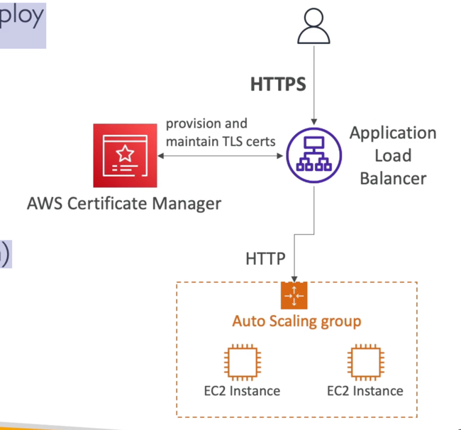

# ACM (AWS Certificate Manager)

- Lets you easily provision, manage, and deploy
- Used to provide in-flight encryption for websites (HTTPS)
- Supports both public and private TLS certificates
- Free of charge for public TLS certificates
- Automatic TLS certificate renewal
- Integrations with (load TLS certificates on)
- Elastic Load Balancers
- CloudFront Distributions
- APls on API Gateway