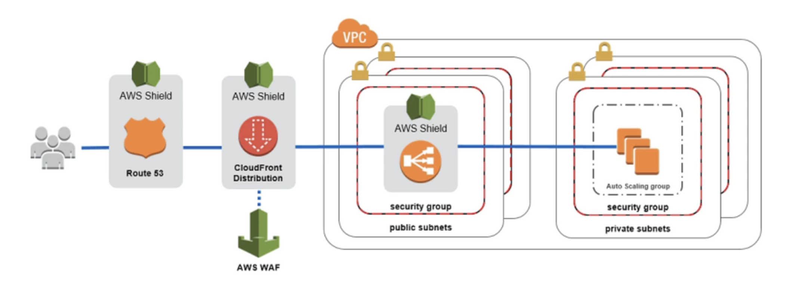

# DDoS Protection (Distributed Denial of Service) on AWS

- AWS Shield Standard: protects against DDOS attack for your website and applications, for all customers at no additional costs
- AWS Shield Advanced: 24/7 premium DDoS protection
- AWS WAF: Filter specific requests based on rules
- CloudFront and Route 53:
    - Availability protection using global edge network
    - Combined with AWS Shield, provides attack mitigation at the edge
- Be ready to scale - leverage AWS Auto Scaling

# Shield
## AWS Shield Standard:
- Free service that is activated for every AWS customer
- Provides protection from attacks such as SYN/UDP Floods, Reflection attacks and other layer 3/layer 4 attacks
## AWS Shield Advanced:
- Optional DDoS mitigation service ($3,000 per month per organization)
- Protect against more sophisticated attack on Amazon EC2, Elastic Load Balancing (ELB), Amazon CloudFront, AWS Global Accelerator, and Route 53
- 2417 access to AWS DDoS response team (DRP)
- Protect against higher fees during usage spikes due to DDoS

# WAF (Web Application Firewall)
- Protects your web applications from common web exploits (Layer 7)
- Layer 7 is HTTP (vs Layer 4 is TCP)
- Deploy on Application Load Balancer, API Gateway, CloudFront
- Define Web ACL (Web Access Control List):
    - Rules can include IP addresses, HTTP headers, HTTP body, or URI strings
    - Protects from common attack - SQL injection and Cross-Site Scripting (XSS)
    - Size constraints, geo-match (block countries)
    - Rate-based rules (to count occurrences of events) - for DDoS protection