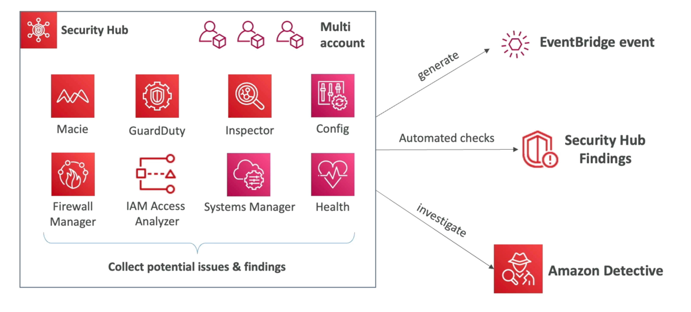

# AWS Security Hub

- Central security tool to manage security across several AWS accounts and automate security checks
- Integrated dashboards showing current security and compliance status to quickly take actions
AWs services & As earter to se defined or personal findings formats trom various
partner tools:
    - Config
    - GuardDuty
    - Inspector
    - Macie
    - IAM Access Analyzer
    - AWS Systems Manager
    - AWS Firewall Manager
    - AWS Health
    - AWS Partner Network Solutions
- Must first enable the AWS Config Service
