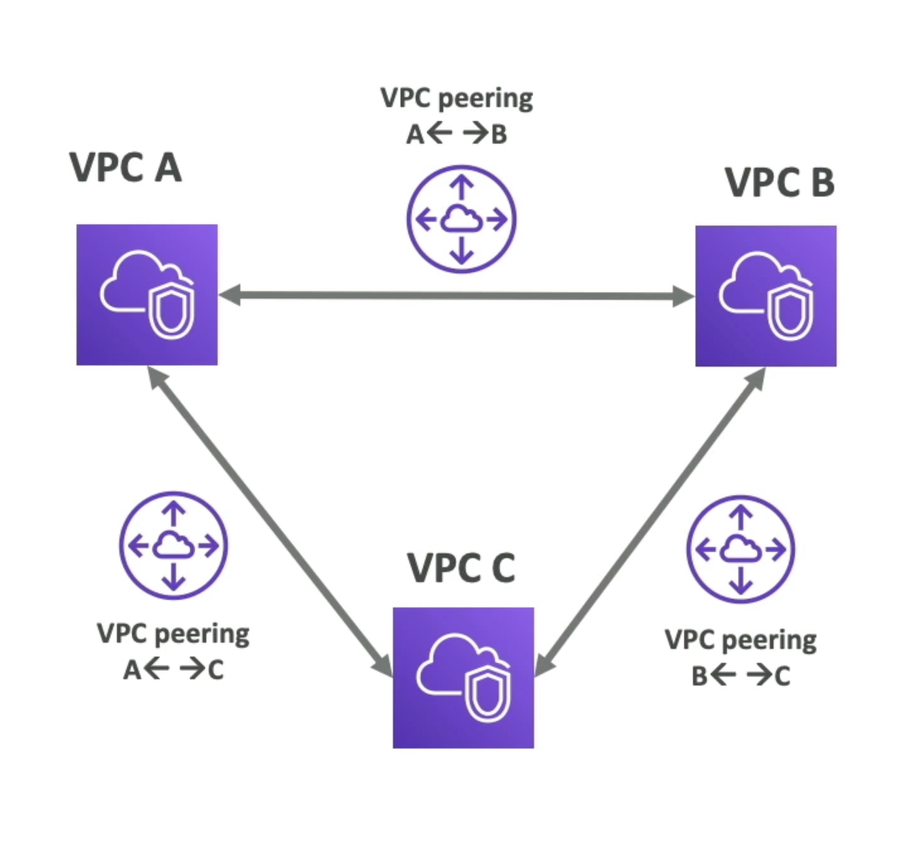

# VPC Flow Logs 
- Capture information about IP traffic going into your interfaces:
    - VPC Flow Logs
    - Subnet Flow Logs
    - Elastic Network Interface Flow Logs
- Helps to monitor & troubleshoot connectivity issues. Example:
    - Subnets to internet
    - Subnets to subnets
     - Internet to subnets
- Captures network information from AWS managed interfaces too: Elastic
Load Balancers, ElastiCache, RDS, Aurora, etc...
- VPC Flow logs data can go to S3, CloudWatch Logs, and Amazon Data Firehose

# VPC Peering

- Connect two VPC, privately using AWS' network
- Make them behave as if they were in the same network
- Must not have overlapping CIDR (IP address range)
- VPC Peering connection is not transitive (must be established for each VPC that need to communicate with one another)

