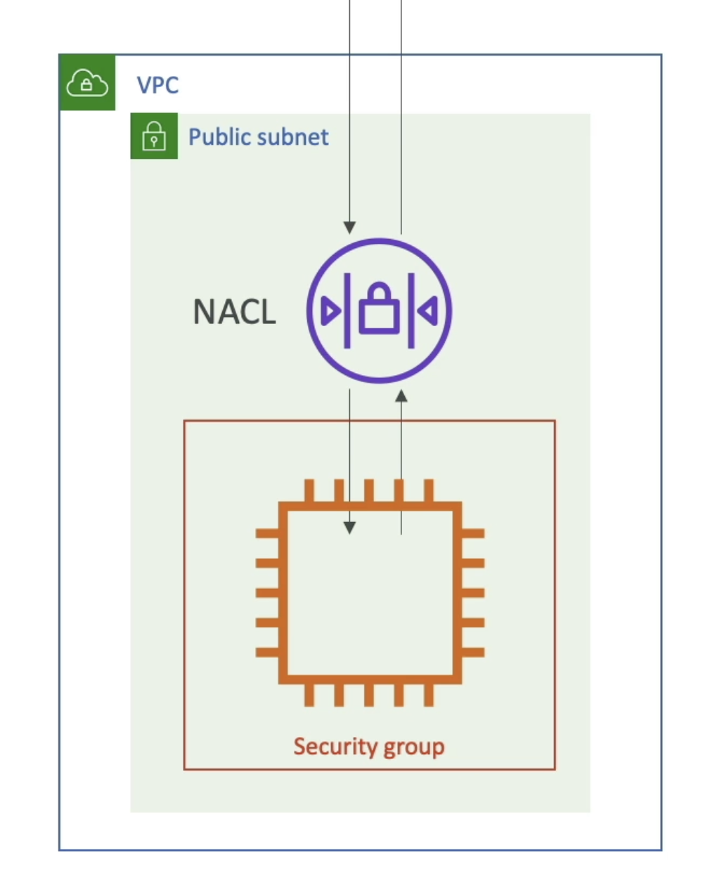
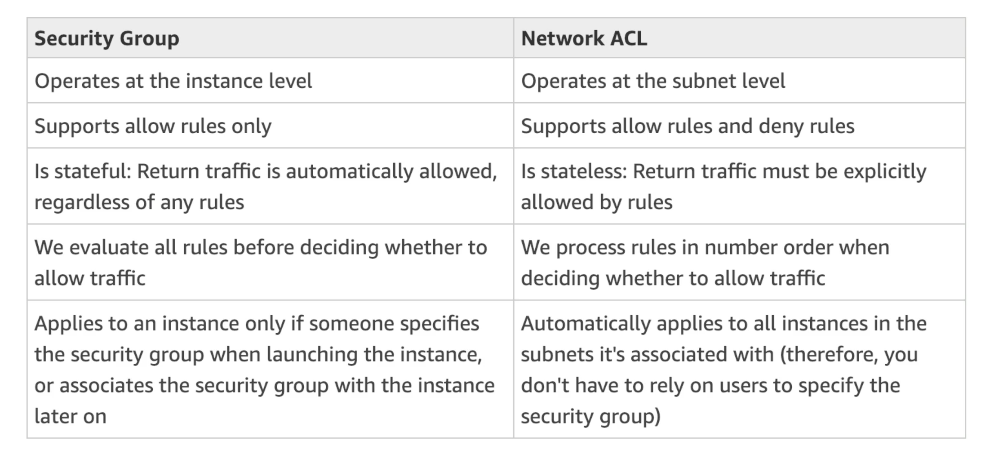

# Network ACL (NACL)
- A firewall which controls traffic from and to subnet
- Can have ALLOW and DENY rules
- Are attached at the Subnet level
- Rules only include IP addresses
# Security Groups
- A firewall that controls traffic to and from an EC2 Instance
- Can have only ALLOW rules
- Rules include IP addresses and other security groups

# Network ACL (NACL) vs Security Groups
