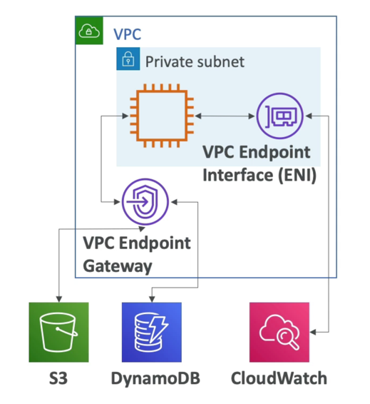

# VPC Endpoint
- Endpoints allow you to connect to AWS Services using a private network instead of the public www network
- This gives you enhanced security and lower latency to access AWS services
- VPC Endpoint Gateway: S3 & DynamoDB
- VPC Endpoint Interface: the rest

# PrivateLink

- Most secure & scalable way to expose a service to 1000s ofVPCs
- Does not require VPC peering, internet gateway, NAT, route tables...
- Requires a network load balancer (Service VPC) and ENI (Customer VPC)

