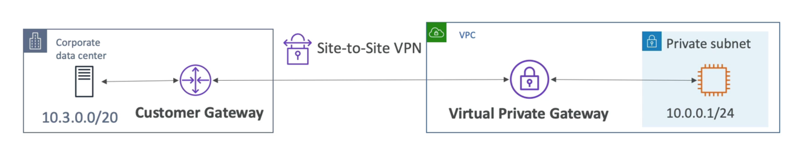

# Site-to-Site VPN vs. Direct Connect

## Site-to-Site VPN
- On-premises: must use a Customer Gateway (CGW)
- AWS: must use a Virtual Private Gateway
VGW

- Connect an on-premises VPN to AWS Public www
- The connection is automatically encrypted
- Goes over the public internet
## Direct Connect
- Establish a physical connection between on-premises and AWS
- The connection is private, secure and fast
- Goes over a private network
- Takes at least a month to establish

# Client VPN

- Connect from your computer using OpenVPN to your private network in AWS and on-premises
- Allow you to connect to your EC2 instances over a private IP (just as if you were in the private VPC network)
- Goes over public Internet

# Transit Gateway

- For having transitive peering between thousands ofVPC and on-premises, hub-and-spoke (star) connection
- One single Gateway to provide this functionality
- Works with Direct Connect Gateway, VPN connections