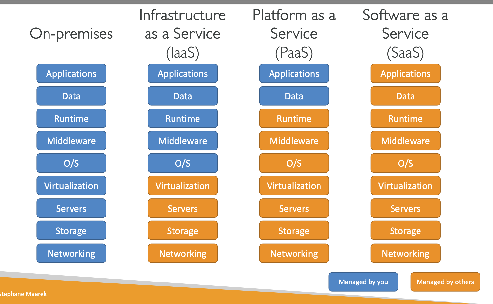

What is a server compose of?

- Compute
- Memory
- Storage
- Database
- Network

Type of Cloud Computing

- Infrastructure as a Service (IaaS)
    Examples:
    - Amazon EC2
    - GCP, Azure
- Platform as a Service (Paas)
    Examples:
    - Elastic Beanstalk
    - Heroku, Google App Engine, Windows Azure
- Software as a Service (SaaS)
    Examples:
    - Rekognition for ML
    - Google Map, Dropbox. Zoom

Pricing of the cloud
- Compute
    - pay for compute time
- Storage
    - pay for data in the cloud
- Data Transfer
    - data transfer in is free

