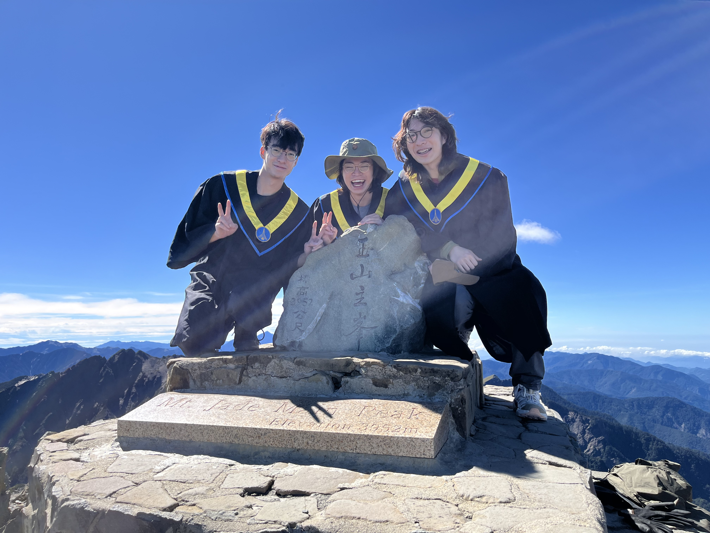

この週末、大学の同級生たちと玉山に登りました。二日一夜の旅の中で、玉山主峰から眺めた絶景は一生忘れられない思い出になりました。
<!-- truncate -->

土曜日の午後、私たちは車をレンタルして、最初の夜を過ごす予定の山小屋に向かいました。道中のコンビニで2日分の食料と軽食を買い、みんなで歌を聴きながらワイワイと楽しくドライブしました。途中、美しい夕焼けも見ることができました。目的地に到着した時にはすでに夜になっており、山小屋でコンビニで買った夕食をみんなで食べました。食事の後、少し散歩しようと外に出たところ、冷たい風が吹きつけてきました。寒さを感じながらも興味が湧き、少し歩いてみることにしました。そして帰ろうとした時、友人が「ちょっと上を見て！」と言い、見上げてみると満天の星空が広がっていました。こんな光景は今まで見たことがなく、感動で胸がいっぱいになりました。急いでスマホでその景色を撮影しました。まるで翌日の登頂の成功を祝福してくれているようでした。

翌朝、私たちは午前3時に起床し、装備を整えて単独行動での登山を開始しました。その時はまだ真っ暗で、ヘッドランプで道を照らしながら進みました。道中、台湾の固有種と思われる動物にも遭遇しました。おそらく台湾山羌（タイワンシカ）だと思いますが、確信はありません。それでも驚きと喜びで胸が高鳴りました。やがて太陽が顔を出し、山谷を明るく照らし始めました。当日の天気は風も雨もなく、まるで天からの贈り物のようでした。標高が上がるにつれ、周囲の植物も広葉樹から針葉樹へと変化していきました。おそらく台湾冷杉（タイワンスギ）や台湾扁柏（タイワンヒノキ）だったのではないかと思います。

時間をしっかり管理しながら歩を進め、ついに午前11時ごろ、登頂を果たしました！最後の道のりは「地獄」という言葉がぴったりでした。ジグザグの急な登り坂に加え、薄い空気の中で一歩進むごとに心臓が激しく鼓動しました。また、両手を使わなければならない場面もありました。本当に天候が良かったおかげで、無事に登頂できたのだと思います。もし風が強かったり雨が降っていたりしたら、ここまで来られなかったでしょう。玉山主峰に立った瞬間、言葉では表現できない感動が胸に湧き上がりました。これが私にとって初めての台湾百岳の登頂でしたが、これからも台湾の高山を自分の足で征服し続けたいと思います！　
