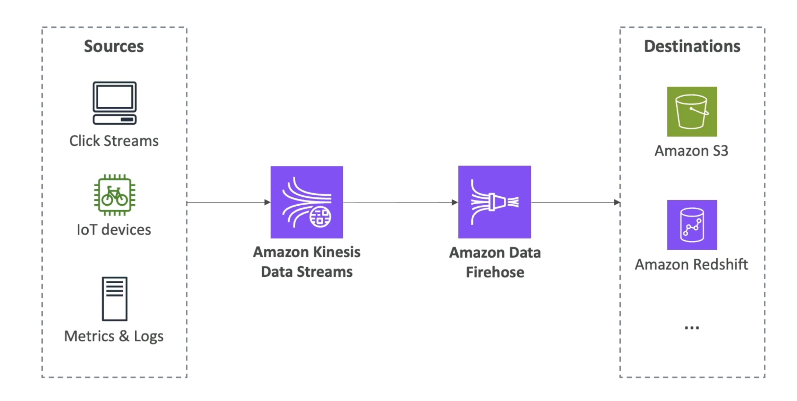

- 試験のために: Kinesis = リアルタイムのビッグデータストリーミング
- リアルタイムストリーミングデータを収集、処理、分析するマネージドサービス
- クラウドプラクティショナー試験には詳細すぎますが、知っておくと良いです:
- Amazon Kinesis Data Streams: 数十万のソースから大規模にデータを取り込む低遅延ストリーミング
- Amazon Data Firehose: Kinesis Data StreamsをAmazon S3, Redshift, OpenSearch, etc...

# キネシスデータストリーム

