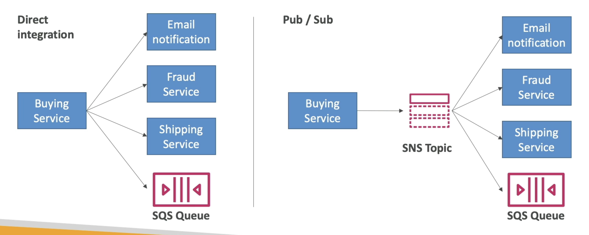

# SNS（シンプルな通知サービス）

- 1つのメッセージを多くの受信者に送信したい場合はどうなりますか?
  
- 「イベント発行者」は1つのSNSトピックにのみメッセージを送信します
- SNSトピックの通知を聞きたい「イベント購読者」の数
- トピックの各購読者は、すべてのメッセージを取得します
- トピックごとに最大 12,500,000 件のサブスクリプション、トピック数が 100,000 件まで制限されます
