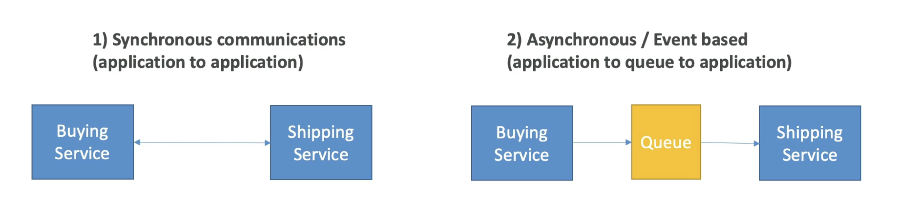

# はじめに

- 複数のアプリケーションをデプロイし始めるときは、必然的に相互に通信する必要があります。
- アプリケーション通信
   のパターンが2つあります。
- 急激なトラフィックの急増がある場合、アプリケーション間の同期が問題になることがあります
- 突然1000本の動画をエンコードする必要がありますが、通常は10本の動画をエンコードする場合はどうなりますか?
- その場合、アプリケーションを分離する方が良いでしょう。
  - SQSを使用: キューモデル
  - SNSを使用: pub/subモデル
  - Kinesisを使用して:リアルタイムデータストリーミングモデル
- これらのサービスは、アプリケーションから独立して拡張できます。

# Summary

- SQS:
  - AWSのキューサービス
  - 複数のプロデューサー、メッセージは最大14日間保持されます
  - 複数の消費者がメッセージの読み取りと削除を完了時に共有します
  - AWSのアプリケーションを分離するために使用
- SNS:
  - AWSの通知サービス
  - 購読者: Eメール, Lambda, SQS, HTTP, Mobile...
  - 複数の購読者にすべてのメッセージを送信する
  - メッセージの保持がありません
- Kinesis: リアルタイムのデータストリーミング、持続性、解析
- Amazon MQ: クラウドのActiveMQとRabbitMQのマネージドメッセージブローカー(MQI I,AMQP.. protocols)
