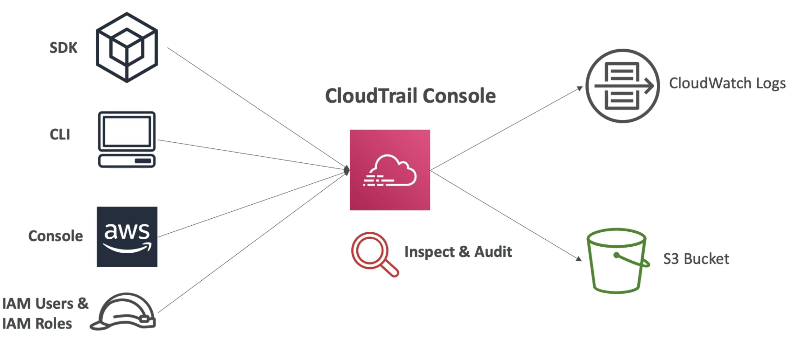

# CloudTrail

- AWSアカウントのガバナンス、コンプライアンス、監査を提供します
- CloudTrailはデフォルトで有効になっています！
- AWSアカウント内で行われたイベント/APl通話の履歴を取得します。
  - コンソール
  - SDK
  - CLI
  - AWSサービス
- CloudTrailからCloudWatchログまたはS3にログを入れることができます
- トレイルは、すべてのリージョン(デフォルト)または単一のリージョンに適用できます。
- AWSでリソースが削除された場合は、まずCloudTrailを調査してください。

# 図

