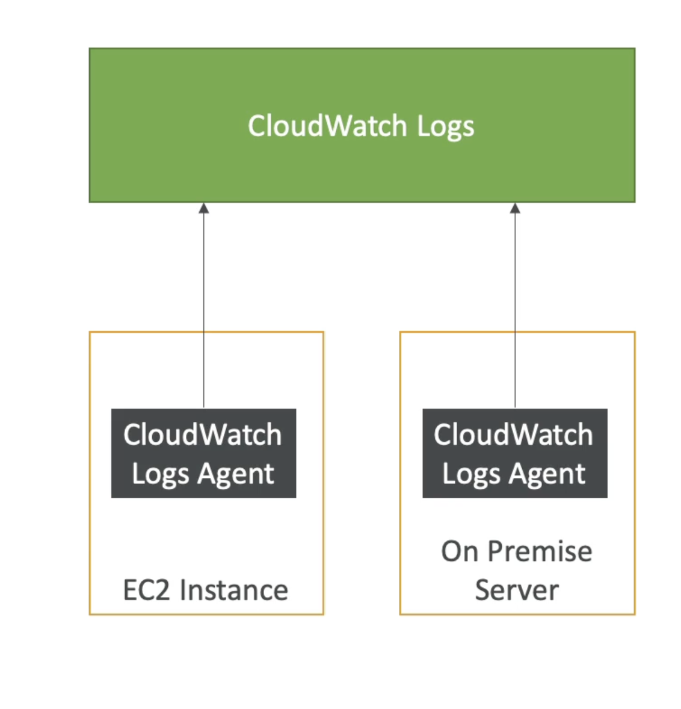

# CloudWatchログ

- CloudWatch Logs は以下からログを収集できます:
  - Elastic Beanstalk: アプリケーションからのログの収集
  - ECS: コンテナからの収集
  - AWS Lambda: 関数ログからの収集
  - フィルターに基づくCloudTrail
  - CloudWatchログエージェント: EC2マシンまたはオンプレミスサーバーでのみ使用できます。
  - Route53: ログの DNS クエリ
- ログのリアルタイム監視を有効にする
- 調整可能なCloudWatchログの保持

# EC2のCloudWatchログ

- デフォルトでは、EC2インスタンスからCloudWatchへのログはありません
- 必要なログファイルをプッシュするには、EC2でCloudWatchエージェントを実行する必要があります。
- IAM の権限が正しいことを確認してください
- CloudWatchログエージェントもオンプレミスでセットアップできます
