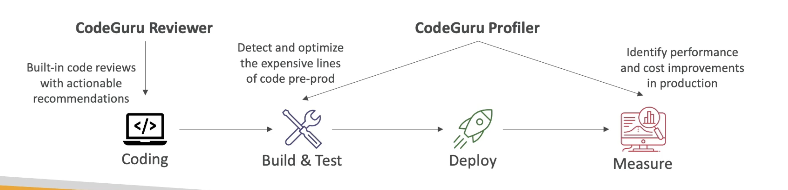

# CodeGuru

- 自動コードレビューとアプリケーションパフォーマンスの推奨のためのML搭載のサービス
- 2つの機能を提供します
- CodeGuru Reviewer: 静的コード解析のための自動コードレビュー (開発)
- CodeGuru Profiler: ランタイム(プロダクション)
  

# CodeGuru レビュアー

- 重要な問題、セキュリティ上の脆弱性、および見つけにくいバグを特定する
- 例: 一般的なコーディングのベストプラクティス、リソースリーク、セキュリティ検出、入力検証
- 機械学習と自動推論を使用
- 数千のオープンソースとAmazonリポジトリに関する何百万ものコードレビューで習得されたレッスン
- JavaとPythonをサポート
- GitHub、CodeCommit、Bitbucket、AWS CodeBuild と統合

# CodeGuru Profiler

- アプリケーションのランタイム動作を理解するのに役立ちます
- 例: アプリケーションがロギングルーチンで過剰なCPU容量を消費しているかどうかを特定します
- 機能:
  - コードの非効率性を特定して削除します
  - アプリケーション・パートルマンスの改善（CPU使用率の低下など）
  - 計算コストを減らす
  - ヒープサマリIDを提供します。どのオブジェクトがメモリを使用しているか)
  - 異常検出
- AWSまたはオンプレミスで動作するアプリケーションをサポート
- アプリケーションでのオーバーヘッドの最小値
