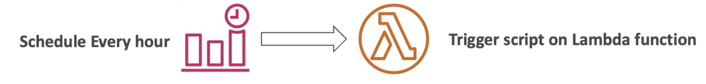

# EventBridge

- スケジュール: Cron ジョブ (スケジュール済みスクリプト)
  
- Event Pattern:
   を行うサービスに反応するイベントルール
- Lambda関数をトリガーし、SQS/SNSメッセージを送信...

例:

----------------------------------

- スキーマレジストリ: モデルイベントスキーマ
- イベントバスに送信されたイベント(すべて/フィルタ)をアーカイブすることができます(無期限または設定期間)
- アーカイブされたイベントを再生する能力
