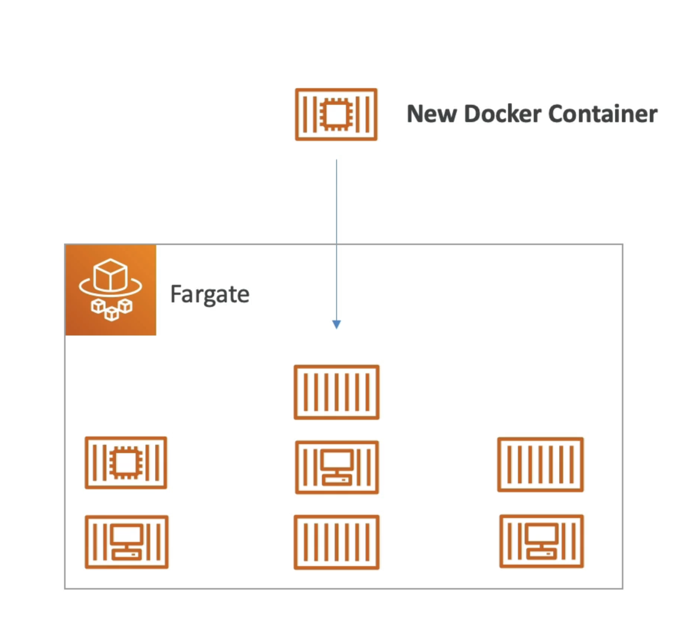
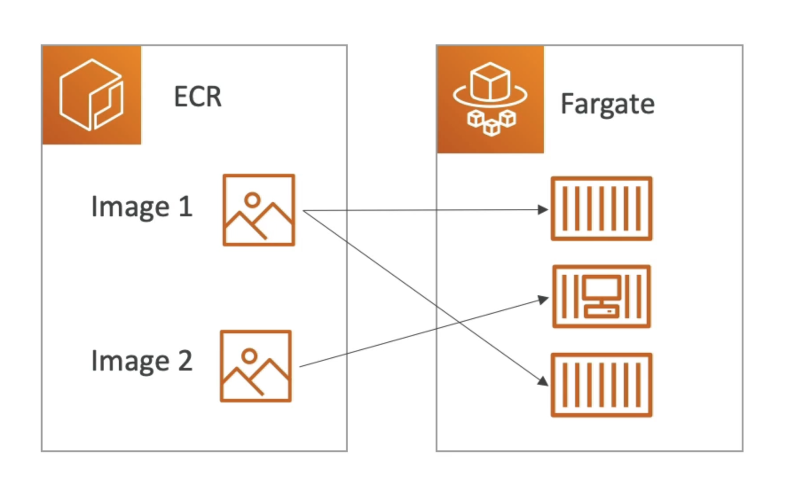
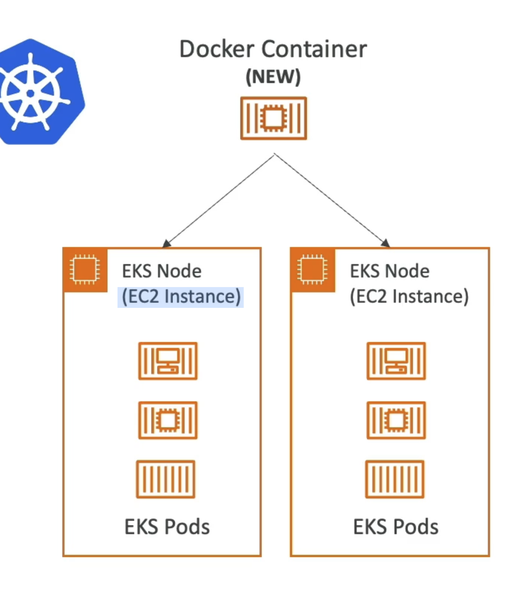

# ECS (Elastic Container Service)

- ECS = Elastic Container Service
- AWS で Docker コンテナーを起動
- インフラストラクチャ(EC2インスタンス)のプロビジョニングと維持が必要です
- AWSはコンテナの起動/停止を処理します
- アプリケーション・ロード・バランサーとの統合

# Fargate

- AWS で Docker コンテナーを起動
- インフラストラクチャ(管理する EC2 インスタンスなし)をプロビジョニングしません。単純です！
- サーバーレスの提供
- AWSは、必要なCPU/RAMに基づいてコンテナを実行します。

# ECR(Elastic Container Registry)

- Elastic Container Registry
- AWSのプライベートDockerレジストリ
- これは、ECSまたはFargateによって実行できるように、Dockerイメージを保存する場所です。

# EKS (Elastic Kubernetes Service)

- EKS = Elastic Kubernetes Service
- AWSで管理された Kubernetes クラスターを起動できます
- Kubernetesは、コンテナ化されたアプリ(Docker)の管理、デプロイ、スケーリングのためのオープンソースシステムです。
- コンテナをホストすることができます：
- EC2インスタンス
- Fargate (Serverless)
- Kubernetesはクラウドに依存しない
  です(AzureやGCPなど、どのクラウドでも利用できます)。
