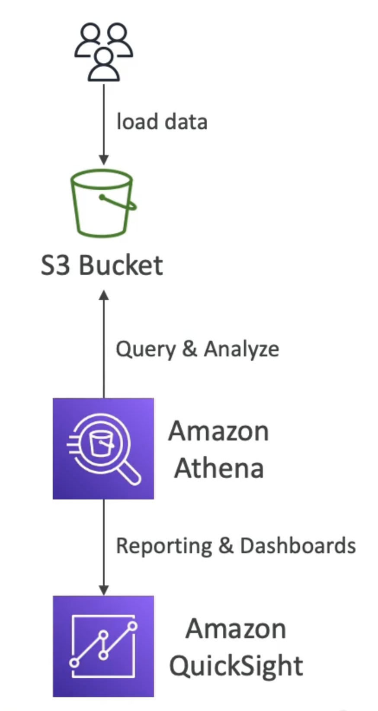

# Amazon Athena

- S3オブジェクトに対する分析を実行するサーバーレスクエリサービス
- 標準のSQL言語を使用してファイルを照会する
- CSV、JSON、ORC、Avro、Parquet（Presto上に構築）をサポート
- 価格: スキャンされたデータあたり$ 5.00
- コスト削減のために圧縮データまたは円柱データを使用します (スキャン回数の少ない)
- ユースケース: ビジネスインテリジェンス/分析/レポート、VPCフローログ、ELBログ、CloudTrailトレイルなどの分析とクエリ...
- 試験のヒント：サーバーレス SQL を使用してデータを分析し、Athena を使用します。
