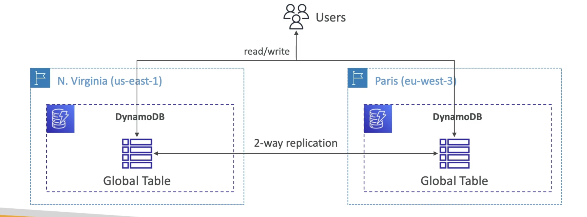

# 概要

- 3 AZを超えるレプリケーションで完全に管理された高度に利用可能です
- NoSQLデータベース - リレーショナルデータベースではありません
- 大規模なワークロード、分散型「サーバーレス」データベース
- 毎秒数百万のリクエスト、兆行、100TBのストレージ
- 高速かつ一貫性のあるパフォーマンス
- 単位ミリ秒レイテンシ（低レイテンシ）
- セキュリティ、承認、管理のためにIAMと統合されています
- 低コストと自動スケーリング機能
- 標準および不頻度アクセス(IA)テーブルクラス

# DynamoDB Data type

- DynamoDB is a key/value database
  

# DynamoDB Accelerator - DAX

!(DynamoDB-Accelerator)[./DynamoDB-Accelerator.png]

- DynamoDB用の完全マネージドインメモリキャッシュ
- 10倍のパフォーマンス向上 - DynamoDBテーブルにアクセスする際の、ミリ秒単位のレイテンシからマイクロ秒のレイテンシへ。
- 安全で高度にスケーラブル、高可用性
- CCPレベルでのElastiCacheとの違い: DAXはDynamoDBにのみ使用され、統合されていますが、ElastiCacheは他のデータベースに使用できます。

# DynamoDB グローバルテーブル

- DynamoDBテーブルを複数のリージョンで低遅延でアクセス可能にする
- アクティブ-アクティブレプリケーション（任意のAWSリージョンへの読み書き）
