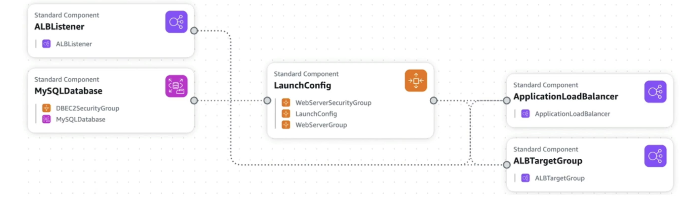

# CloudFormation

- CloudFormationは、あらゆるリソースに対してAWSインフラストラクチャの概要を宣言的な方法です(ほとんどがサポートされています)。
- たとえば、CloudFormationテンプレート内では、次のように言います。
  - セキュリティグループが欲しい
  - このセキュリティグループを使用して2つのEC2インスタンスが必要です
  - S3バケットが欲しい
  - これらのマシンの前にロードバランサー(ELB)が必要です
- CloudFormationは、指定された正確な構成で、正しい順序でそれらを作成します。

# メリット

## Infrastructure as code

- 手動で作成されたリソースはありません。管理に最適です。
- インフラストラクチャへの変更はコードを通じて確認されます

## コスト

- スタック内の各リソースには識別子がタグ付けされているため、スタックのコストを簡単に確認できます。
- CloudFormationテンプレートを使用してリソースのコストを見積もることができます
- 保存戦略: Devでは、午後5時にテンプレートの削除を自動化し、午前8時に安全に再作成できます。

## Productivity

- クラウド上でインフラストラクチャを破壊して再構築する能力
- テンプレートのダイアグラムの自動生成！
- 宣言型プログラミング (順序とオーケストレーションを把握する必要はありません)

## ホイールを再発明しないでください

- ウェブ上の既存のテンプレートを活用してください！
- ドキュメントを活用する

## すべてのAWSリソースをサポート (ほぼ)

- このコースで表示されるすべての内容がサポートされています
- サポートされていないリソースには「カスタムリソース」を使用できます

# CloudFormation + Infrastructure Composer

- 例:WordPress CloudFormationスタック
- すべてのリソースを見ることができます
- コンポーネント
   間の関係を見ることができます。
