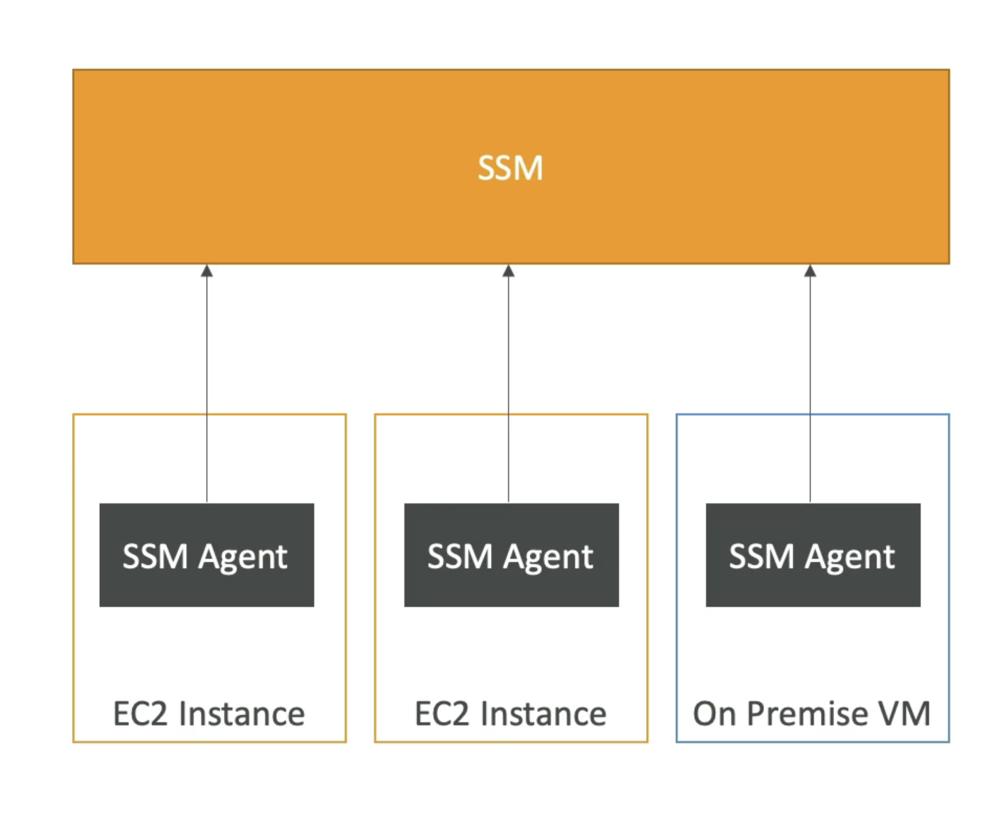

# SSM

- 大規模な EC2 システムおよびオンプレミスシステムの管理を支援します。
- 別のハイブリッドAWSサービス
- インフラストラクチャの状態についての運用に関する洞察を取得
- Suite of 10+ products
- 最も重要な機能は次のとおりです。
  - コンプライアンスを強化するパッチ自動化
  - サーバーの艦隊全体でコマンドを実行する
  - SSMパラメータストアでパラメータ設定を保存
- Linux、Windows、MacOS、Raspberry Pi OS (Raspbian) で動作します

# 仕組み

- SSMエージェントを制御するシステムにインストールする必要があります
- Amazon Linux AMLといくつかのUbuntu AMIにデフォルトでインストールされています
- SSMでインスタンスを制御できない場合は、インスタンスになります。 おそらくSSMエージェントの問題だ
- SSMエージェントのおかげで、コマンドを実行し、パッチを適用してサーバーを構成することができます。

# SSM セッション マネージャー

- EC2サーバーとオンプレミスサーバーで安全なシェルを起動することができます
- SSHアクセス、要塞ホスト、またはSSHキーが必要ありません
- 22番ポートは必要ありません（より良いセキュリティ）
- Linux、macOS、Windowsに対応しています
- セッションログデータをS3またはCloudWatchログに送信する

# システムマネージャパラメータストア

- 設定とシークレット用のセキュアストレージ
- API キー、パスワード、設定...
- サーバーレス、スケーラブル、耐久性、簡単なSDK
- IAM を使用してアクセス権限を制御する
- バージョン追跡＆暗号化 (オプション)
