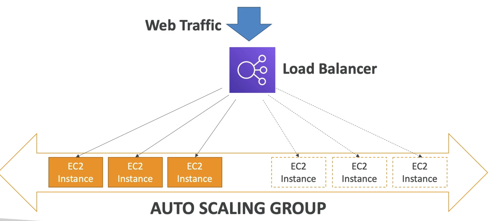

# 自動スケーリンググループ入門 (ASG)

- 実生活では、ウェブサイトとアプリケーションの負荷が変更される可能性があります
- クラウドでは、サーバーをすばやく作成して取り除くことができます
- 自動スケーリンググループ (ASG) の目標は次のとおりです。
- 負荷の増加に合わせてスケールアウト（EC2インスタンスを追加）
- 負荷の減少に合わせてスケールイン（EC2インスタンスを削除）
- 動作するマシンの最小数と最大数を確認してください
- 新しいインスタンスをロードバランサーに自動的に登録する
- 不健全なインスタンスを置き換え
- コスト削減：最適な容量（クラウドの原則）でのみ実行できます

# スケーリング戦略

## 自動スケーリンググループ - スケーリング戦略

- 手動スケーリング: ASG のサイズを手動で更新

## ダイナミックスケーリング: 需要の変化に対応する

- シンプル/ステップスケール
- CloudWatchアラームがトリガーされた場合（例：CPU未満70%）、2単位を追加
- CloudWatchアラームがトリガーされた場合（CPUが30%未満の場合）、次に私を削除します
- Target Tracking Scaling
- 例: 平均的なASGCPUを40%程度にとどめたい場合

## スケジュールされたスケール

- 既知の使用パターンに基づいてスケーリングを予測する
- 例: 金曜日の午後5時に最小容量を10に増やします

## 予測スケール

- 機械学習を使用して、将来のトラフィックを事前に予測する
- 自動的に
  は事前に EC2
  インスタンスの適切な数を規定します

# ELB & ASG - Summary

- 高可用性対スケーラビリティ（垂直方向と水平方向）対柔軟性対俊敏性
- 弾性ロードバランサー (ELB)
- バックエンドのEC2インスタンス間でトラフィックを分散し、Multi-AZにすることができます
- ヘルスチェックをサポート
- 4 種類: Classic (old), Application (HTTP - L7), Network (TCP - L4), Gateway (L3)
- 自動スケーリンググループ (ASG)
- アプリケーションの弾力性を複数のAZで実装
- システムの需要に基づいてEC2インスタンスを拡大し、不健康に置き換えてください
- ELBと統合
