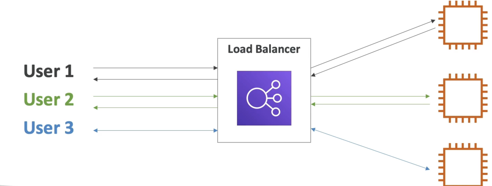
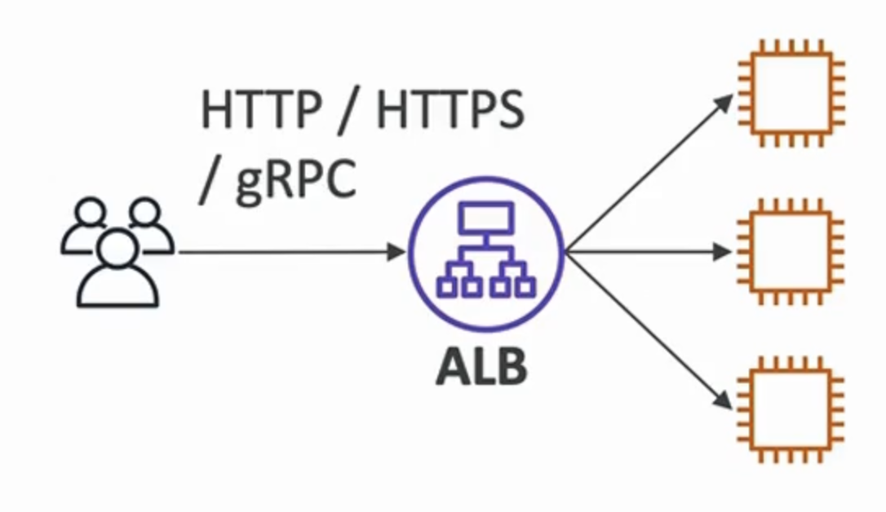
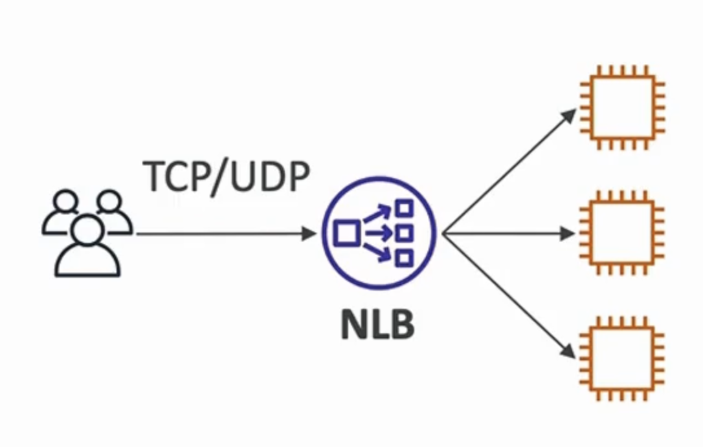

# 弾性ロードバランサー入門

- 複数のダウンストリームインスタンスに負荷を拡散する
- アプリケーションに単一のアクセスポイント(DNS)を公開します
- 下流インスタンスの障害をシームレスに処理します
- インスタンスの定期的なヘルスチェックを行う
- ウェブサイトにSSL終了（HTTPS）を提供する
- ゾーン全体で高可用性
- ELB (Elastic Load Balancer) は管理されたロードバランサーです。
- AWSは動作することを保証します
- AWSはアップグレード、メンテナンス、高可用性の面倒を見る
- AWSは少数の設定ノブのみを提供します
- 自社のロードバランサのセットアップにはコストはかかりませんが、エンド(メンテナンス、インテグレーション)にはより多くの労力を要します。

# AWSが提供する4種類のロードバランサ:

- アプリケーションロードバランサー (HTTP / HTTPSのみ) - レイヤ 7
- ネットワーク負荷バランサー (超高性能、TCPが可能) - レイヤ 4
- ゲートウェイロードバランサー - レイヤ 3
- Classic Load Balancer(2023年に引退) - Layer 4 & 7

# アプリケーションロードバランサー (ALB)

-  / HTTPS / gRPCプロトコル（レイヤ 7）
-  ルーティング機能
- Static DNS (URL)
  

# ネットワークロードバランサー (NLB)

- TCP / UDP プロトコル（レイヤ 4）
- ハイパフォーマンス：毎秒数百万のリクエスト
- Elastic IP
  

# ゲートウェイロードバランサー (GWLB)

- IPパケット上のジュネーブプロトコル (レイヤ 3)
- EC2インスタンスで管理するファイアウォールへのトラフィックのルート
- 侵入検出
  
