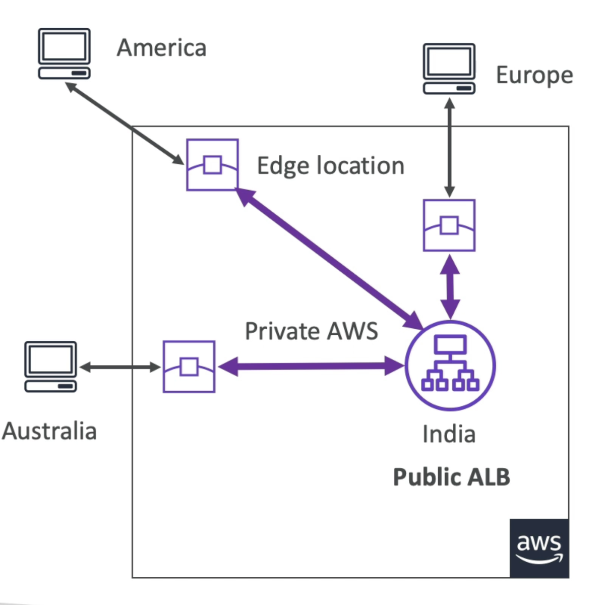
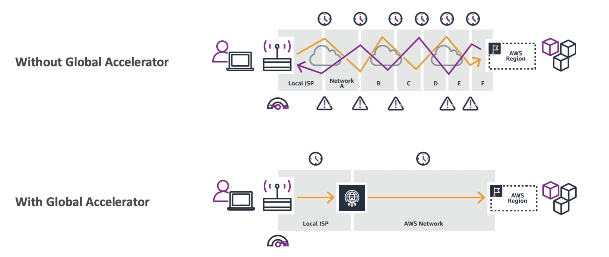

# Global Accelerator

- AWSのグローバル ネットワークを使用して、グローバル アプリケーションの可用性とパフォーマンスを向上させます
- AWSの内部ネットワークを活用してアプリケーションへのルートを最適化します (60%の改善)
- 2アプリケーション用にAnycast IPが作成され、トラフィックはエッジ位置を通じて送信されます。
- エッジの場所は、あなたのアプリケーションにトラフィックを送信します

# 図

# Global Accelerator vs. CloudFront

- 両方ともAWSのグローバルネットワークと世界中のエッジロケーションを使用しています
- 両方のサービスは、AWS Shield for DDoS保護用に統合されています。
- CloudFront - コンテンツ配信ネットワーク
  - キャッシュ可能なコンテンツ（画像や動画など）のパフォーマンスを向上させます
  - コンテンツはエッジで表示されます
- Global Accelerator
  - 1つまたは複数のAWSリージョンで実行されているアプリケーションにエッジでパケットをプロキシするキャッシュはありません。
  - TCPまたはUDPを介した幅広いアプリケーションのパフォーマンスを向上させます
  - 静的IPアドレスを必要とするHTTPのユースケースに適しています
  - 決定的で高速な地域的フェイルオーバーを必要とするHTTPユースケースに適しています
