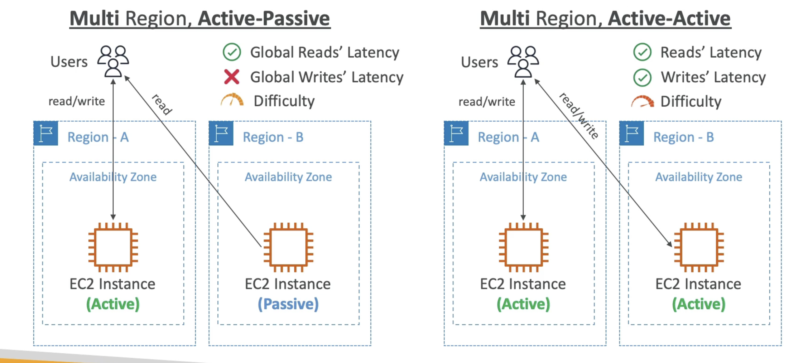

# ローカルゾーン

- AWSの計算、ストレージ、データベース、およびその他の選択されたAWSサービスを、レイテンシーに敏感なアプリケーションを実行するエンドユーザーに近づけます。
- VPCを他の場所に拡張する -
  "AWSリージョンの拡張"
- EC2, RDS, ECS, EBS, ElastiCache, Direct Connect ...
- 例
- AWS Region: N. Virginia (us-east-I)
- AWSローカルゾーン：ボストン、シカゴ、ダラス、ヒューストン、マイアミなど

# グローバルアプリケーションアーキテクチャ

