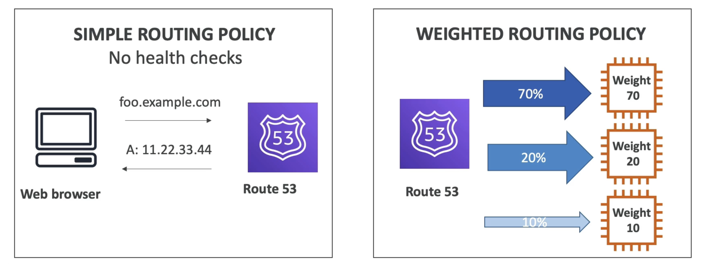

# 概要

- Route53は管理されたDNS(Domain Name System)です
- DNSは、クライアントがURLを介してサーバーに到達する方法を理解するのに役立つルールとレコードの集まりです。
- AWSでは、最も一般的なレコードは次のとおりです。
- www.google.com == 12.34.56.78 == A record (IPV4)
- www.google.com => 2001:0db8:85a3:000000:00:8a2e:0370:7334 == AAAA IPv6
- search.google.com => www.google.com == CNAME: hostname to hostname
- example.com == AWS resource == Alias (ex: ELB, CloudFront, S3, RDS, etc...)

# 図

# ルーティングポリシー

