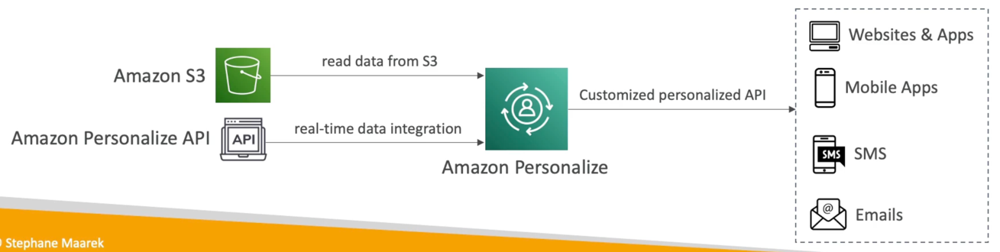

# 個人設定

- リアルタイムでパーソナライズされた推奨事項でアプリを構築するための完全管理型MLサービス
- 例: パーソナライズされた製品の推奨/再ランキング、カスタマイズされたダイレクトマーケティング
- 例: ユーザーはガーデニングツールを購入し、次のものを購入するための推奨事項を提供します。
- Amazon.comで使用されているのと同じ技術
- 既存のウェブサイト、アプリケーション、SMS、電子メールマーケティングシステムに統合します。
- 月単位ではなく日単位での実装 (ML ソリューションの構築、トレーニング、デプロイは必要ありません)
- ユースケース:小売店、メディア、エンターテインメント...
