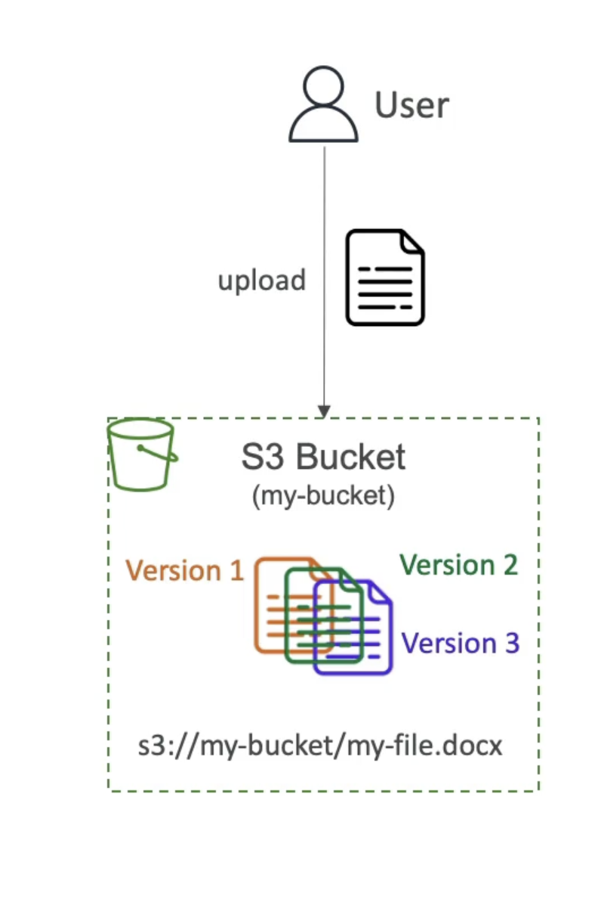
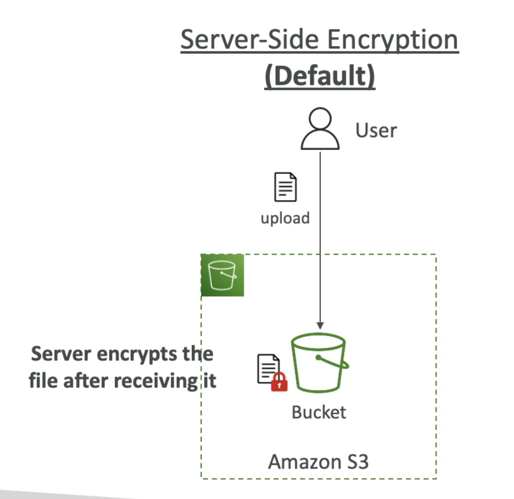

# ケースを使用

- バックアップとストレージ
- 災害回復
- アーカイブ
- ハイブリッドクラウドストレージ
- アプリケーションのホスティング
- メディアホスティング
- データレイクとビッグデータ分析
- ソフトウェア配信
- 静的なウェブサイト

# バケツ入りバケツ

- Amazon S3 では、オブジェクト (ファイル) を "バケット" (ディレクトリ) に保存できます。
- バケットにはグローバルに一意な名前が必要です（すべての地域ですべてのアカウントで）
- バケットはリージョンレベルで定義されています
- S3はグローバルサービスのように見えますが、バケットはリージョン内で作成されます

# オブジェクト

- オブジェクト (ファイル) にはキーがあります
- キーはフルパスです:
  - s3://my-bucket/my_file.txt
  - s3://my-bucket/my_folderl/another_folder/my_file.txt
- キーはプレフィックス+オブジェクト名で構成されています
  - s3://my-bucket/my_folder|/another_folder/my_file.txt
- バケツの中には「ディレクトリ」という概念はありません(ただし、ウルはそうでないと考えるようにあなたを騙すでしょう)

## 含まれている

- オブジェクトの値は本文の内容です:
- 最大 オブジェクトサイズは 5TB (5000GB)
- 5GBを超える場合は、"マルチパートアップロード"を使用する必要があります
- メタデータ (テキストキー / 値のペアのリスト - システムまたはユーザーメタデータ)
- タグ (Unicode キー / 値ペア - 最大 10) - セキュリティ/ライフサイクルに便利です
- バージョンID（バージョン管理が有効な場合）

# セキュリティ

## ユーザーベース

- IAM ポリシー - IAM から特定のユーザーに API コールを許可する必要があります

## リソースベース

- バケットポリシー - S3コンソールからバケット全体のルールを許可する - クロスアカウントを許可する
- オブジェクトアクセス制御リスト(ACL) - 粒度の細かい（無効にできます）
- Bucket Access Control List (ACL) - 一般的ではない (無効にできます)

## 注: IAM プリンシパルが S3 オブジェクトにアクセスできます。

- ユーザーの IAM 権限を許可するか、リソースポリシーで許可する
- そして明示的なDENYはありません

## 暗号化: 暗号化キーを使用して Amazon S3 のオブジェクトを暗号化

# S3 バケットポリシー

- JSON ベースのポリシー
  - リソース: バケットとオブジェクト
  - エフェクト: 許可/拒否
  - アクション: 許可または拒否する APl のセット
  - 原則: ポリシーを適用するアカウントまたはユーザー
- ポリシーにS3バケットを使用:
  - バケツへのアクセスを許可
  - アップロード時にオブジェクトを強制的に暗号化する
  - 別のアカウントへのアクセスを許可 (クロスアカウント)

# S3 Static Website

- あなたがウェブサイトにアクセスできるように、すべてのブケットを公開する必要があります。

# S3 Versioning

- Amazon S3でファイルをバージョンアップできます
- バケットレベルで有効になっています
- 同じキーの上書きは "version" を変更します: 1,2,3....
- バケツをバージョンアップするのがベストプラクティスです
- 意図しない削除から保護 (バージョンを復元する能力)
- 以前のバージョンへの簡単なロール

## メモ:

- バージョン管理を有効にする前にバージョン管理されていないファイルには、「null」のバージョンがあります。
- Suspending versioning does not delete the previous version
  

# S3レプリケーション（CRR & SRR）

- ソースと宛先バケットでバージョン管理を有効にする必要があります
- クロスリージョンレプリケーション（CRR）
- 同一領域のレプリケーション（SRR）
- バケットは別のAWSアカウントにすることができます
- コピーは非同期です
- S3非同期レプリケーションに適切なIAM権限を付与する必要があります
- ユースケース：
- CRR - コンプライアンス、低レイテンシアクセス、アカウント間でのレプリケーション。
- SRR - ログ集計、プロダクションとテストの間のライブレプリケーション。

# S3 ストレージクラス

## Amazon S3 Standard - General 目的

- 99.99%の在庫状況
- 頻繁にアクセスするデータに使用
- 低遅延と高いスループットです
- サステイン2同時設備障害
- ユースケース: ビッグデータ分析、モバイル&ゲームアプリケーション、コンテンツ配信...

---

- アクセス頻度が低いが、必要に応じて迅速なアクセスが必要なデータの場合。
- S3標準より低コストです

## Amazon S3 Standard-Infrequent Access (IA)

- 99.9%の在庫状況
- 使用事例：災害復旧、バックアップ

## Amazon S3 1ゾーン不頻度アクセス

- 単一のAZでの高い耐久性(99.9999999%);AZが破壊されたときに失われたデータ
- 99.5%の在庫状況

---

- アーカイブ/バックアップ用の低コストオブジェクトストレージ
- 価格：ストレージ価格+オブジェクト検索コスト

## Amazon S3 Glacier インスタント取得

- ミリ秒検索、データへのアクセスに最適な 4 分の 1 回
- 最小保管期間 (90日間)

## Amazon S3 Glacier 柔軟検索

- 迅速化(5分まで)、スタンダード(3〜5時間)、バルク(5〜12時間) - 無料
- 最小保管期間 (90日間)

## Amazon S3 Glacier Deep Archive

- 標準 (12時間)、バルク(48時間)
- 180日間の最小保管期間

---

## Amazon S3 Intelligent Tiering

- 小額の月額モニタリングと自動階層化

- アクセスレイヤー間でオブジェクトを自動的に移動します。

- S3インテリジェント・ティアリングには検索料金はありません

- 頻繁なアクセスレイヤー(自動):デフォルトのTier

- 不頻度アクセス階層（自動）：30日間アクセスできないオブジェクト

- アーカイブ即時アクセス階層（自動）：90日間アクセスできないオブジェクト

- アーカイブアクセスレイヤー(オプション):90日から700日以上に設定可能

- Deep Archive Access tier (オプション): config. 180日から700日以上

- クラス間を手動またはS3ライフサイクル構成で移動できます

# 耐久性と在庫状況

## 耐久値：

- 複数AZのオブジェクトの耐久性（99.9999999%、1 | 9's）
- Amazon S3で1,000万個のオブジェクトを保存している場合、平均して1万年に1個のオブジェクトが失われることを期待できます。
- すべてのストレージクラスと同じ

## 可用性:

- サービスがどのくらい容易に利用できるかを測定します
- ストレージクラスによって異なります
- 例: S3規格の可用性は99.99%=年間53分では利用できません

# 暗号化

## サーバー側の暗号化

## クライアント側の暗号化

# S3用のIAMアクセスアナライザー

- 意図した人だけがあなたのS3バケットにアクセスできるようにします
- 例: パブリックアクセス可能なバケット、他のAWSアカウントと共有されたバケット...
- S3 バケットポリシー、S3 ACL、S3 アクセス ポイントポリシーを評価します
- Powered by IAM Access Analyzer

# S3の責任モデルを共有

## AWSの責任:

- インフラストラクチャ (グローバル セキュリティ、耐久性、可用性、2 つの施設で同時にデータが失われる場合)
- 設定と脆弱性分析
- コンプライアンス検証

## 顧客の責任:

- S3 Versioning
- S3 Bucket ポリシー
- S3 レプリケーションのセットアップ
- ロギングとモニタリング
- S3 ストレージクラス
- 残りのデータと移動中のデータ暗号化
