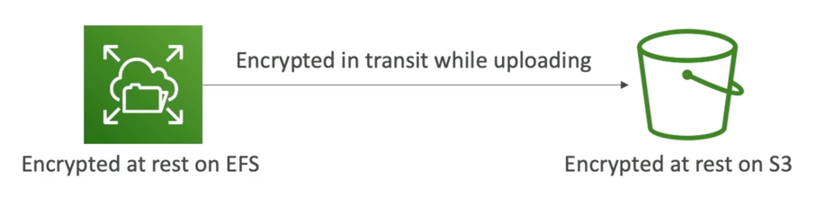

# 残りのデータと輸送中のデータ

- 残り: デバイスに保存またはアーカイブされたデータ
- ハードディスク、RDSインスタンス、S3氷河ディープアーカイブなど。
- 移動中（移動中）：ある場所から別の場所にデータを移動する
- オンプレミスからAWS、EC2からDynamoDBなどへの転送
- ネットワーク上で転送されるデータを意味
- 両方の州のデータを暗号化して保護します！
- このため、暗号化キーを活用しています。

# KMS (キーマネジメントサービス)

- AWSサービスの「暗号化」をいつでも聞くことができます。おそらくKMSです
- KMS = AWSが暗号化キーを管理します
- 暗号化オプトイン:
  - EBSボリューム: ボリュームの暗号化
  - S3 バケット: オブジェクトのサーバー側暗号化 (デフォルトでは、SSE-KMS オプトイン)
  - Redshift データベース: encryption of data
  - RDSデータベース: データの暗号化
  - EFS ドライブ: データの暗号化
- 自動的に暗号化が有効化されました:
  - 雲の軌跡ログ
  - S3 Glacier
  - ストレージゲートウェイ

# CloudHSM（ハードウェアセキュリティモジュール）

- KMS == AWSは暗号化用のソフトウェアを管理します
- CloudHSM == AWSは暗号化ハードウェアを規定します
- 専用ハードウェア (HSM = ハードウェアセキュリティモジュール)
- 独自の暗号化キーを完全に管理します (AWSではありません)
- HSMデバイスは改ざん耐性FIPS 140-2レベル3準拠です

# KMSキーの種類

## 顧客管理キー:

- 顧客が作成、管理、使用、有効または無効にすることができます
- 回転ポリシーの可能性 (毎年生成される新しいキー、古いキーが保存されます)
- あなた自身のキーを持参する可能性

## AWS Managed Key:

- AWSが顧客に代わって作成、管理、使用
- AWSサービスで使用（aws/s3, aws/ebs, aws/redshift）

## AWSが所有するキー:

- AWSサービスが所有し、複数のアカウントで使用できるCMKのコレクション
- AWSはアカウントのリソースを保護するためにこれらを使用できます（ただし、キーは表示できません）

## CloudHSMキー (カスタムキーストア):

- CloudHSMハードウェアデバイスから生成されたキー
- 暗号化操作はCloudHSMクラスタ内で実行されます
